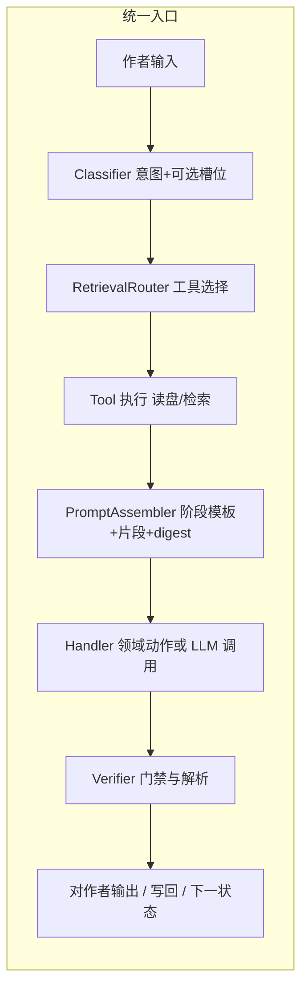

# 作者在环 Agent Harness（统一入口与类人交互）

**文档类型**：**L2 SDD**（结构设计、组件、迁移步骤；**不**替代 L1 行为规约）  
**版本**：2026-04-13  
**状态**：设计稿（与现有 `classify_intent` / `retrieve_for_intent` / 分阶段菜单**并行演进**；本文描述目标态）  
**必备 Spec（L1）**：[specs/author-in-loop-spec.md](../specs/author-in-loop-spec.md)（MUST/SHOULD/不承诺；与本文分工见该文 §1）  
**关联**：[author-interaction.md](./author-interaction.md)（状态机、M1–M6）、[memory-storage-and-retrieval.md](./memory-storage-and-retrieval.md)、[TECH_IMPLEMENTATION.md](../../TECH_IMPLEMENTATION.md) §6

---

## 1. 问题与目标

### 1.1 当前痛点与能力边界（摘要）

**管线与一致性**

- **分类与检索只挂在少数「菜单点」**：例如设定主菜单读入 `y/e/c/p` 后做一次 `classify_intent` / `retrieve_for_intent`，而作者在子流程里输入的长句（如「上次已经写过主角，请确认」）**不再**走同一套管线。
- **检索结果未稳定注入下游 LLM**：`session.extra["intent_retrieval"]` 等缺少与 `SettingResearchAgent`、`discuss_freely`、正文回合等路径的**统一契约**。
- **交互不像同一个人**：阶段切换时规则分叉多，作者感知为「不同子系统在接话」，而非单一对话主体在**先理解再查再答**。

**创作辅助与思路演化**

- **缺少「智能助手主动协创」层**：难以在合适时机**自动**联想、跳脱式建议、追问或提供多方案对比；当前多为**被动**响应固定菜单与阶段流程，作者跳跃、改向、试错的节奏难以被系统温柔地接住并延续。
- **变化中的思路未一等公民建模**：多轮之间「刚才想写 A、现在想改成 B」的**创意线程 / 工作记忆**若只靠散落的 prompt 与文件，助手无法稳定地**对齐作者当下意图**并减少重复劳动；统一 Harness 解决的是**入口与上下文拼装**，仍须叠加**创意状态**（可选显式对象或摘要链）才能逼近「像人在一块白板前一起想」。

**规模与全自动成书**

- **缺少「续写潜力评估」**：尚不能综合**当前与作者已交流的设定、正文、会话与落盘记忆**等，向作者给出**量化或区间化**的结论——在约定质量/一致性假设下，系统**后续最多还能自动写出多长（字数或章节量）**、主要受限于哪些缺口（大纲空白、记忆未覆盖、矛盾未解决等）。该能力**不作为现阶段实现**，但作为**长期规划**写入 §7.1。  
- **框架优化本身不等价于百万字全自动**：即便入口、检索、工具链全部理顺，**单条作者诉求 → 无审阅、全自动输出百万字级以上长篇**仍受硬约束；与上条「评估能力」不同——评估是**告知上限**，全自动执行是**另一层产品决策**，须与 L0 **作者在环**显式协调。

### 1.2 目标陈述

1. **每一次**作者向系统提交的**自然语言输入**（含菜单键、短命令、长段落），都经过**同一套入口管线**：**分类 →（按需）检索/工具 → 阶段策略 → 生成或动作**。
2. **阶段**（设定主菜单、设定多轮讨论、正篇回合审阅等）只决定**合法意图集合、可用工具、系统提示词模板、写回门禁**，**不**在入口处用「if 在 design_phase 里就跳过分类」这类硬分叉替代统一入口。
3. **类人交互**：单一「作者侧对话主体」——在界面层可以仍是多个 Agent 能力，但在**控制流**上表现为：**先听懂 → 再决定要不要翻材料（记忆/设定/正文）→ 再说话或执行**。

### 1.3 与上述痛点的关系（便于排期）

| 痛点类别 | Harness 直接覆盖的部分 | 需额外专题/产品决策的部分 |
|----------|-------------------------|---------------------------|
| 管线与一致性 | **是**：统一入口、检索注入、阶段策略包 | 具体 Tool 列表与 Handler 实现 |
| 创作辅助与思路演化 | **部分**：更好的上下文 = 更好联想的基础；**主动建议**还需策略（何时打断、何种 tone）与可选「协创模式」配置 | 创意线程数据结构、DevAgent/搜索联想与主流程的衔接 |
| 百万字全自动 | **否**（默认非目标） | 超长篇编排、是否在环、质量与成本模型 |
| 续写长度/章节潜力评估 | **否**（现阶段不实现） | §7.1 长期规划：一致性模型、大纲/记忆覆盖度、成本与展示 UX |

---

## 2. 与业界「Agent Harness」的对应

> 参考公开论述中常见的 **Agent Harness** 观念：把大模型当作「推理核」，外层用 **Harness（运行时）** 管理生命周期、上下文、工具、终止条件与治理（例如 [The Anatomy of an Agent Harness](https://blog.langchain.com/the-anatomy-of-an-agent-harness/) 等）。本仓库不绑定某一商业产品，仅借用**分层职责**做对齐。

| Harness 能力 | 在「作者在环」中的含义 |
|--------------|------------------------|
| **编排（Orchestration）** | 单次作者输入的**有界状态机**：分类 → 检索/工具 → Handler → 验证 → 输出；步骤预算、超时、失败降级。 |
| **上下文管理（Context）** | **按阶段组装的只读包**：阶段 system 提示、`last_round_digest`、检索片段、菜单/合法操作说明；显式预算与注入点，避免「整块历史糊进模型」。 |
| **工具（Tools）** | **检索与副作用**的统一抽象：读 `world.yaml`、读 `setting_research_output`、扫 `book/setting`、`content/turns`、渐进式 `memory/`、设计会话等；可扩展受控联网工具（如 Playwright 路线）。分类结果或策略决定**调用哪些工具**、**顺序与预算**。 |
| **验证（Verification）** | 结构化输出校验（意图 JSON）、写回前门禁（如 `is_world_config_empty`）、YAML 解析失败回退、配额错误处理。 |
| **运维（Operations）** | 日志字段统一（intent、tools、token 粗估）、可测试的 `input_fn` 注入、与 DevAgent/CI 对齐的回归场景。 |

**一句话**：模型负责「在给定上下文与工具结果下怎么措辞与推理」；**Harness 负责「每一轮作者输入进来后，系统先做什么、能看见什么、允许改什么」**。

---

## 3. SDD 设计原则（与 L1 Spec 对齐）

下列准则支撑 [author-in-loop-spec.md](../specs/author-in-loop-spec.md) 中 MUST/SHOULD 的**实现方式**；若准则与 Spec 冲突，以 Spec 为准并回写本文。

1. **统一入口，不统一模型**：入口管线唯一；底层仍可调用不同 LLM、不同领域 Agent（设定研究、审阅、摘要），但**调用顺序与上下文拼装**由 Harness 决定。  
2. **分类先于检索，检索先于大段生成**：落实 Spec「依赖已落盘内容时的检索义务」；禁止仅靠一句 `reference` 让模型在无材料情况下替代检索。  
3. **阶段 = 策略面，不是第二套入口**：`AuthorPhaseState`（或等价枚举）提供：`allowed_intents`、`tool_allowlist`、`prompt_profile_id`、`exit_guards`。  
4. **可观测**：落实 Spec「可观测」条款；每一轮至少记录：`phase`、`raw_input`、`intent_id`、`tools_used`、`snippet_sources`（摘要）、是否触发写回。  
5. **与现有 M1–M6 兼容演进**：`AuthorSession`、`last_round_digest`、持久化路径保留；逐步把各 `read_line` 分支**收束**到 Harness 调度，而非一次性重写所有 UI 字符串。
6. **策略包动态装配**：规则集合按 `phase + intent + novel profile` 动态选择，不再把所有约束固化在单体 prompt；策略包需版本化并可回滚。  
7. **自我迭代可审计**：任何规则更新先进入候选区（candidate patch），经评估门禁后才生效；核心规则默认只允许建议模式生成补丁，不直接覆盖。

---

## 4. 目标架构（逻辑组件）

### 4.1 组件说明

| 组件 | 职责 | 备注 |
|------|------|------|
| **Classifier** | 输出 `intent_id`、置信度、`retrieval_query`（或槽位）、是否需澄清 | 白名单由 **phase** 裁剪；可规则 + 可选 LLM；与现 `classify_intent` 对齐并扩展为**每轮可用**。 |
| **RetrievalRouter** | 据意图与 query 决定调用哪些 **Tools**、预算分配 | 替代「固定四类 snippet 写死」；可插策略（设定向 vs 正文向）。 |
| **Tools** | 无副作用只读：聚合为 `list[RetrievalSnippet]` | 与现 `retrieve_for_intent` 同源演进，拆为可组合工具集。 |
| **PromptAssembler** | `system_phase` + `intent_hint` + `snippets` + `digest` + `optional_menu` | 单一函数签名，供设定讨论、主菜单、回合审阅复用。 |
| **Handler** | 映射 `intent_id` → 业务过程 | 如：`design_complete` → 门闩检查；`input_idea_discuss` → 调用设定研究链路且**注入** Assembler 输出。 |
| **Verifier** | 配置校验、退出条件、结构化输出 | 与 `is_world_config_empty`、YAML 安全加载等对齐。 |

**组装后上下文压缩（可选演进）**：检索片段拼接完成后，若长度逼近预算上限，目标态**不宜**仅依赖 `retrieve_for_intent` 内字符截断；**自适应分层任务锚定**、**Compression Contract** 与分阶段落地见专题 SDD **[context-compression-adaptive-layered.md](./context-compression-adaptive-layered.md)（登记表 D8）**。

### 4.2 阶段（Phase）与策略包（示例）

| Phase | 典型 `allowed_intents` | 工具倾向 | 说明 |
|-------|------------------------|----------|------|
| `DESIGN_MAIN` | 完成设定、编辑文件、输入想法、保存进度 | world、setting_research、book/setting | 与现主菜单一致 |
| `DESIGN_FREETEXT` | 讨论、澄清、引用已写内容、保存片段 | + design_session、+ 按需 turns/memory | **作者在长句里提到「上次/正文/记忆」时**，Router 必须能打开对应工具 |
| `MAIN_WRITING` | 审阅、修订、补充设定、… | author_classified、turn 摘要、记忆渐进式 | 与 §6.2 两阶段审阅对齐 |

阶段切换仍可由 **Handler 成功返回** 触发，但切换前后**入口仍是同一 Harness**，仅 **策略包** 替换。

### 4.3 自我迭代闭环（目标态）

在统一入口基础上增加轻量「反思-更新」闭环，默认以**建议模式**运行：

1. **Critic**：对本轮输出打分（一致性、节奏、角色稳定性、新颖度、作者偏好贴合度）。  
2. **PolicyUpdater**：仅产出候选规则补丁（`candidate_patch`），并标注证据（来源片段、触发输入、评分变化）。  
3. **Gate**：按门禁判定（最小样本数、硬约束不破坏、预算）决定生效、降权或回滚。  
4. **PolicyStore**：记录版本、优先级、作用域（global/novel/phase/intent）及最近收益分。

> 约束：默认不自动改写不可变核心规则（如作者确认门闩、两阶段审阅语义）；仅允许更新可配置策略包层。

`candidate_patch` 建议最小字段（I4 最小实现）：

- `patch_id`: 候选补丁唯一标识  
- `scope`: `global | novel | phase | intent`  
- `target`: 目标键（如 `phase:MAIN_WRITING`、`intent:review_revise`）  
- `operation`: `add_rule | remove_rule | update_rule`  
- `content`: 规则正文（建议文本）  
- `evidence`: `trigger_input`、`critic_scores`、`source_refs`  
- `risk_level`: `low | medium | high`  
- `manual_review_required`: 是否必须人工确认（默认 `true`）

`Gate` 最小校验项（I4 最小实现）：

- schema 校验：字段齐全且类型合法  
- 作用域白名单：仅允许 `global/novel/phase/intent`  
- 操作白名单：仅允许 `add_rule/remove_rule/update_rule`  
- 证据完整性：`evidence` 不可为空  
- 核心规则保护：命中不可变核心规则时直接拒绝并要求人工审阅

### 4.4 章节目标驱动的节奏约束（Pacing Contract）

为解决“回合推进过快、暗线一次性暴露”的问题，`TurnPlan -> 正文生成` 之间增加 **Pacing Controller**（可作为 PolicyAssembler 的子阶段）：

1. **输入**：当前 `chapter_goal`、当前 beat/进度、阶段意图、角色在场信息。  
2. **输出**：结构化约束 `pacing_contract`，正文生成必须遵守。  
3. **检查**：阶段一审阅与 Critic 都对 `pacing_contract` 做偏差评分。

`pacing_contract` 建议最小字段：

- `pace_mode`: `slow_burn | balanced | push`  
- `goal_window`: `铺垫 | 推进 | 兑现`（由章节目标映射）  
- `plot_exposure_budget`: 本回合主线推进预算（低/中/高）  
- `subplot_reveal_budget`: 暗线显露上限（`hint | signal | partial | reveal`）  
- `character_action_caps`: 角色高影响动作上限（按角色与窗口）  
- `forbidden_moves`: 本回合禁止动作（如“不得揭示反派身份”）

暗线显露协议（Subplot Reveal Protocol）：

- `hint`：仅异常细节，不解释因果；  
- `signal`：可追踪线索，但不闭环；  
- `partial`：局部因果解释，仍保留缺口；  
- `reveal`：明确身份/动机/机制。

> 约束：若 `goal_window=铺垫`，默认不得超过 `signal`；若需越级，必须在策略包中显式声明并记录原因。

---

## 5. 与「类人交互」的对齐

- **一致的心智模型**：作者始终在对「同一个助手」说话；助手的行为差异来自「当前在订设定还是在改正文」，而不是突然换了一套不查档的规则。  
- **先确认再发挥**：对「指涉已存在内容」的 utterance，分类器应倾向触发 **retrieve** 意图或子槽位（需在后续实现中定义训练/规则）；Harness 保证检索结果进入 Prompt，再让领域 Agent 回答。  
- **失败可解释**：检索为空时，由 Harness 统一话术（「未找到对应段落，是否用关键词再搜或先 e 编辑文件」），避免模型编造。

---

## 6. 与现有代码的映射（迁移导向）

| 现状 | 目标态 |
|------|--------|
| （新建）**`src/author_harness/`** | **R1+** 实现包：与 `author_loop` 并存；**R2** `prompt_assembler`；**R4** `retrieval_registry`；**R6** `author_harness.py`（`apply_design_main_menu_ingress` / `AuthorHarness`） |
| `run_design_phase` 内多处 `read_line` 直连分支 | 每次 `read_line` 返回值进入 **Harness.handle(phase, text)** |
| `retrieve_for_intent` 仅主菜单调用、`retrieval_query` 未用 | Router 对**每轮**使用 query；扩展工具注册表 |
| `session.extra["intent_retrieval"]` 无消费者 | **PromptAssembler** 唯一写入口；Handler 禁止绕过；**R7 后**阶段一 `revise` 路径亦为消费者之一（见 §6.3） |
| `discuss_freely` 仅 theme/genre/special 摘要 | 增加 **`assembled_context`** 参数（由 Harness 注入） |
| `SettingResearchAgent.run(reference=...)` | `reference` 与 **检索片段** 合并进 Assembler，再调用 run |
| 提示词规则主要散落在 prompt 文本 | 收敛为 `PolicyStore + PolicyAssembler`（先文档化与配置化，再渐进替换） |
| 联网能力 | 设定讨论链：`classify_intent` 产出 `internet_search_needed` / `internet_query`（按需）；`retrieve_for_intent` 在 Gate 通过时追加 Playwright+Bing 摘要（配额/超时/`require_classifier_signal`）；专用搜索 API 为后续替换项 |

迁移建议 **按阶段切片**（与 `planning/next-iteration.md` 可挂钩）：

1. **H1**：抽出 `PromptAssembler`，设定主菜单路径强制使用（行为不变，结构统一）。  
2. **H2**：`DESIGN_MAIN` 与 `DESIGN_FREETEXT`（c 子流程）共用 Classifier + Router + Assembler；`discuss_freely` / `agent.run` 接入组装上下文。  
3. **H3**：`MAIN_WRITING` 回合审阅接入同一 Harness；`author_classified_memory` 与渐进记忆进入 Tool。  
4. **H4**：指标与测试：`tests/unit` 覆盖「分类→工具列表→prompt 片段包含某源文件关键字」。

### 6.1 Harness 重构细分（R0–R8，编码切片）

**目的**：将 H1–H4 再拆成**可独立合并**的小步，避免单 PR 混杂多阶段；顺序上 **R0 为每轮迭代闸门**，R1 起才动 `src/`。与 [planning/next-iteration.md](../planning/next-iteration.md) 中 **R\*** 表对照。

| 代号 | 内容 | 对应 H | 验收要点 |
|------|------|--------|----------|
| **R0** | **文档闸**：对齐 S2、本文 §4–§6、**author-interaction** 相关段；更新 next-iteration / WORKLOG；**方案经确认后再开写代码** | S0 / 闸门 | 无代码或仅文档；PR 描述可引用规约段落 |
| **R1** | 新建包/模块空壳（如 `src/author_harness/` 或 `author_loop/harness/`）：类型、`__init__`、**无行为** import 单测 | H1 前置 | **已实现**：`src/author_harness/` + `tests/unit/test_author_harness_package.py`；`pytest` 通过；默认不改变 `design_phase` 行为（R3 才接线） |
| **R2** | **PromptAssembler** 纯函数（入参结构化上下文 → 拼 prompt 片段）+ 单测 | H1 | **已实现**：`prompt_assembler.assemble_retrieval_prompt_block`；`layout="default"` 对拍 `format_snippets_for_prompt`；`layout="design_discussion"` → `format_snippets_design_discussion` |
| **R3** | 设定**主菜单**路径：下游 LLM **仅经** Assembler 注入片段；与改前行为等价或可回归断言 | H1 | **已实现**：`design_phase` 写 `session.extra["intent_retrieval"]` → `assemble_retrieval_prompt_block`（默认 layout）；回归 `test_design_phase` |
| **R4** | **RetrievalRouter**：`retrieval_query`（或等价字段）在路由中**生效**；Tool/源注册表骨架 | H2 前置 | **已实现**：`retrieval_registry.py`（`INTENT_RETRIEVAL_TOOL_CHAINS`）；`retrieve_for_intent` 按 query token 对片段**加权预算**并 debug 日志；单测 `test_retrieval_query_boosts_matching_snippet_length` |
| **R5** | **`c` 子流程**每轮：Classifier → Router → Assembler → `discuss_freely` / `agent.run` | H2 | **已实现**：`phase=DESIGN_DISCUSSION` 时 `classify_intent`（含 `config_dir`）→ `retrieve_for_intent(profile=design_discussion)` → `assemble_retrieval_prompt_block(layout=design_discussion)`；`discuss_freely(..., compressed_retrieval_is_canonical=True)`；主菜单长句等价 **c** |
| **R6** | 抽出 **AuthorHarness.handle**（或等价薄层）；`read_line` / 主菜单分支**委托** Harness，与现有 M1–M6 模块共存 | H2 收口 | **已实现**：`apply_design_main_menu_ingress` + `AuthorHarness`；`run_design_phase` 主菜单委托；`author_loop/__init__.py` **延迟** `run_design_phase` 打破与 `retrieve_for_intent` 的环；单测 `test_author_harness_design_main` |
| **R7** | **MAIN_WRITING** 回合审阅走同一 Harness；`author_classified_memory` 等按 SDD 进 Tool/Assembler | H3 | **✅**：§6.3 子步 **R7a–R7e**；与 §6.2 两阶段审阅不冲突 |
| **R8** | **可观测**：约定字段/日志键；`pytest`「分类 → 工具列表 → 片段含关键字」 | H4 | **✅**：`cli` 审阅日志 + `test_apply_main_writing_review_ingress_revise`；与 S2 §2.4、§3 原则 4 一致 |

**约束**：禁止跳过 R0；**禁止**在单个 PR 内合并 R2+R5 或 R3+R7 等跨阶段大块（除非显式标注为「实验分支」且不合并主分支）。

### 6.2 下一阶段扩展切片（I0–I6，文档先行）

| 代号 | 内容 | 依赖 | 验收要点 |
|------|------|------|----------|
| **I0** | 文档闸：S2/D6/D7/next-iteration/WORKLOG 同步「联网 + 自我迭代 + 动态规则」 | 无 | **✅ 已完成**（文档同步） |
| **I1** | `PolicyStore` 结构与配置源（全局/作品/阶段/意图） | I0 | **✅ 已完成（最小实现）**：`policy_store.py` + `test_policy_store.py`，默认不改行为 |
| **I2** | `PolicyAssembler`：按 phase+intent 组装规则块并替换现有散落拼接点；接入 `pacing_contract` 组装 | I1 | **✅ 已完成（最小链路）**：`policy_assembler.py` 接入 `turn_planning`，正文链可读 pacing 字段 |
| **I3** | `Critic` 评分器与日志字段（先规则评分，后可选 LLM）；增加节奏偏差评分 | I2 | **✅ 已完成（最小实现）**：正文链输出评分与原因；含 `pace_deviation` / `subplot_reveal_deviation` |
| **I4** | `PolicyUpdater` 候选补丁与门禁（仅建议模式） | I3 | **✅ 已完成（最小实现）**：`I4a` candidate patch + `I4b` Gate 校验；均不自动生效 |
| **I5** | 受控联网 Tool（Playwright+Bing，`internet_query`/`require_classifier_signal`）接入 retrieve 链 | I2 | 分类器按需信号 + 配额/超时/来源生效；可查 `internet:playwright:bing` 片段 |
| **I6** | A/B 评估与回滚策略（按收益分调权） | I4/I5 | 可回滚且不破坏核心门闩 |

### 6.3 MAIN_WRITING 审阅 Harness（R7 规划与分步）

**L1 对齐**：[specs/author-in-loop-spec.md](../specs/author-in-loop-spec.md) **§3.4**（SHOULD + 不得破坏两阶段审阅）。

#### 现状（实现事实，便于 diff）

| 环节 | 模块 | 行为摘要 |
|------|------|----------|
| 阶段一循环 | `run_novel_with_author.py` | 调用 `review_turn_result` |
| 意图分流 | `turn_planning.understand_author_review_intent` → `classify_intent`（**`phase=MAIN_WRITING_REVIEW`**） | 与历史规则对拍：`y`/关键词→`confirm`，`n`→`reject`，`e`→`edit`，`s`→`supplement`，**其余→`revise`**；稳定 **`review_*`** intent_id + **`retrieval_query`**（R7b） |
| 审阅检索 | `retrieve_for_intent` + `INTENT_RETRIEVAL_TOOL_CHAINS` | **`INTENT_REVIEW_REVISE`**：`scope_recent_events` + `author_interaction_state`（R7c） |
| 审阅 Harness | `apply_main_writing_review_ingress` | **R7d**：`review_turn_result` 在传入 **config_dir / project_root / storage** 时委托；`revise` 时组装 **`retrieval_block`** |
| 修订正文 | `turn_planning.revise_body_by_feedback` | **R7d**：可选 **`assembled_context`** 注入检索块；否则与旧行为一致 |
| 阶段二 | `cli.review_memory_plan` | 独立提示与确认；未接检索 |
| 会话 | `AuthorSession` | 主循环已用 `read_line`；审阅 **digest** 仍可后续接入 `LastRoundDigest`（可选增强） |

#### 目标态（与 §3 原则 1–4 一致）

1. 为 **阶段一**内「每一轮作者输入」定义等价 **phase**（文档名建议 `MAIN_WRITING_REVIEW` 或挂在 `AuthorPhaseState.phase`，与 TECH **§6.2 阶段一**语义一致）。  
2. **Classifier**：保留 **菜单键 / 短命令** 快速路径（与现 `understand_author_review_intent` **行为对拍**或提供显式迁移清单）；对 **`revise`** 及模糊输入输出 **`retrieval_query`**（可与作者原句相同或经 LLM 压缩）。  
3. **RetrievalRouter / 工具**：在 `retrieval_registry` **新增** MAIN_WRITING 专用工具链（**勿**与 `DESIGN_MAIN_SETTING_TOOLS` 混用一条链）；候选工具（按优先级 MVP → 扩展）：**最近 N 回合正文/摘要**、`author_interaction_state` digest、**渐进式 author_classified** 片段、**大纲/当前节拍** snippet（与 `outline_store` 一致）、可选 **scope 记忆**只读摘要。  
4. **PromptAssembler**：优先复用 `assemble_retrieval_prompt_block`；若需「正文+检索+约束」结构化排版，可增 **`assemble_review_revise_context(...)`**（纯函数，单测对拍）。  
5. **Handler**：`revise_body_by_feedback` 增加可选 **`assembled_context`**（与 `discuss_freely` 模式一致）；`confirm` / `reject` / `edit` / `supplement` **短路**时可跳过检索或走零片段。  
6. **阶段二**：**R7e 可选**——仅增加可观测字段或极轻量检索；**不得**合并阶段或削弱二次确认语义。

#### 依赖与风险

- **依赖**：`Orchestrator` / `storage` / `data_root` 路径在审阅时可解析；与 [memory-storage-and-retrieval.md](./memory-storage-and-retrieval.md) 只读约定一致。  
- **风险**：审阅每轮多一次检索 → 延迟与费用；须 **cap** 与 **按意图短路**。  
- **导入环**：`author_harness` 若反向依赖 `cli.review_turn_result` 顶层，需 **懒加载** 或 **函数内 import**（比照 R6 `run_design_phase`）。

#### R7 子切片（**单 PR 一步**；编码前 R7a 文档闸）

| 子步 | 交付物 | 依赖 | 验收要点 |
|------|--------|------|----------|
| **R7a** | S2 §3.4、本文 §6.3、`next-iteration` R7 子表、WORKLOG | 无代码 | 评审通过 |
| **R7b** | `phase=MAIN_WRITING_REVIEW`（或等价）下 **分类**：扩展 `classify_intent` **或** 新增 `classify_main_review_intent`，与 `understand_author_review_intent` 对拍或附迁移说明 | R7a | **✅**：`classify_intent` 增 `MAIN_WRITING_REVIEW`；`understand_author_review_intent`→`classify_intent`；`main_review_intent_to_cli_action`；单测对拍 |
| **R7c** | **检索**：`INTENT_RETRIEVAL_TOOL_CHAINS` 增加审阅专用 intent→工具；实现 **1～2 个**只读工具（如最近回合 + digest） | R7b | **✅**：`INTENT_REVIEW_REVISE`→`scope_recent_events`+`author_interaction_state`；`retrieve_for_intent(storage, scope_id)`；单测 |
| **R7d** | **Harness**：`apply_main_writing_review_ingress`（或 `AuthorHarness` 方法）；`review_turn_result` **委托** ingress；`revise_body_by_feedback(..., assembled_context=...)` | R7c | **✅** `apply_main_writing_review_ingress`；`run_novel_with_author` 传 **storage**；单测 `test_apply_main_writing_review_ingress_revise` |
| **R7e**（可选） | 阶段二 `review_memory_plan`：可观测或轻量检索 | R7d 稳定 | **✅**：`PHASE_MEMORY_PLAN_REVIEW`、`memory_plan_action`；不弱化双确认 |

**建议编码顺序**：R7b → R7c → R7d → R7e；**R8** 可与 R7d 同 PR 增加日志字段，或紧随其后专 PR。

**R8 落地（审阅路径）**：`review_turn_result` 在 Harness 分支每轮打印 `phase=MAIN_WRITING_REVIEW`、`intent_id`、`retrieval_sources`、`retrieval_chars`；单测 `test_apply_main_writing_review_ingress_revise` 断言 **分类 → 检索源 → 组装块**；`apply_main_writing_review_ingress` **函数内 import** 以避免 `author_loop` 包与 `author_harness` 环状依赖。

---

## 7. 非目标与风险

- **非目标**：本文不规定具体 UI（CLI/Web）；不绑定 LangGraph/LangChain 具体版本；不要求一步替换所有设定研究内部 prompt。  
- **非目标（现阶段实现范围）**：**不实现**「**续写潜力评估**」——即基于当前与作者交流所得的**设定、正文、对话及已持久化材料**，评估在既定质量/一致性假设下，系统**后续最多可自动续写多少字数或多少章**（并向作者解释主要限制因素）。该能力列为 **§7.1 长期规划**，与 Harness H1–H4 **解耦**。  
- **非目标（能力承诺）**：**不**将「根据作者一句诉求全自动写出百万字级以上长篇、且无需在环审阅」列为默认交付；若产品要走向**执行层**全自动超长连载，须单独规约（大纲-卷-章流水线、抽检、一致性维护、成本上限），并与 L0 **作者在环**理念显式对齐或修订。**注意**：将来若实现 §7.1 的**评估**能力，其产出是「可写上限/风险提示」，**不等于**默认执行到该上限。  
- **风险**：每轮分类 + 多工具调用增加 **延迟与成本**——需预算上限、缓存与同轮去重。  
- **风险**：意图白名单爆炸——需按阶段严格裁剪，并保持 **INTENT 注册表** 与文档同步。  
- **风险**：「主动联想」若缺少频率与相关性闸门，易打断心流或产生幻觉建议——需可配置强度与作者显式开关。  
- **风险（§7.1）**：「续写潜力」若被模型**过度自信**表述，会误导作者——须规则化/校准输出（区间、置信说明、强制列出缺口项）。

### 7.1 长期规划：续写潜力评估（文档级）

**意图**：在作者**不增加新输入**或**仅维持当前协作状态**的前提下，系统根据已有设定档、正文回合、记忆摘要、大纲/节拍覆盖度等，输出**可解释的**估计：例如「在现有材料下，约可稳定自动续写 **N～M 万字** 或 **K 章**，主要瓶颈是 …」。  

**依赖（单独立项时须具备）**：统一 Harness 与检索（否则无法可靠汇总上下文）；大纲/节拍与正文对齐程度；跨回合一致性检查或评分；成本与 token 预算模型；可选与作者在环策略结合（评估后仍由作者决定是否启动批量生成）。  

**与百万字全自动的关系**：评估回答「**还能写多长**」；是否**真的自动写满**该长度属于产品开关与规约范围，默认仍受作者在环约束。

---

## 8. 文档与规约关系

| 层级 | 文档 | 职责 |
|------|------|------|
| **L0** | [DESIGN.md](../../DESIGN.md) §6.7 | 产品在环、协创与超长篇边界（摘要） |
| **L1 Spec** | [specs/author-in-loop-spec.md](../specs/author-in-loop-spec.md) | 作者在环 MUST/SHOULD/不承诺 |
| **L1 技术总规** | [TECH_IMPLEMENTATION.md](../../TECH_IMPLEMENTATION.md) §6 | 回合模型 + §6.0 索引 |
| **L2 SDD** | **本文** + [author-interaction.md](./author-interaction.md) | Harness 架构与状态机；SDD 之间冲突时以 **本文统一入口** 优先，回写 author-interaction |
| **L3** | [planning/next-iteration.md](../planning/next-iteration.md) | 落地步骤与 Spec/SDD 对照表 |

---

## 9. 修订记录

| 日期 | 说明 |
|------|------|
| 2026-05-01 | I5 按需联网 + 讨论检索压缩：`internet_search_*`；`RETRIEVAL_PROFILE_DESIGN_DISCUSSION`；`assemble_retrieval_prompt_block(layout=design_discussion)`；Bing 见 `playwright_search` |
| 2026-04-13（七续） | §6.2 I4 状态更新为 ✅（最小实现）；对应代码 `policy_updater.py` + `policy_gate.py` 与单测落地 |
| 2026-04-13（六续） | §4.3 补充 I4 最小实现口径：`candidate_patch` 字段、Gate 最小校验项；§6.2 I4 验收拆分 I4a/I4b |
| 2026-04-13（三续） | §6.2 I 状态更新：I0/I1/I2 最小链路落地；下一步 I3 Critic 可观测评分 |
| 2026-04-13（续） | 新增 §4.4「章节目标驱动节奏约束（Pacing Contract）」；I2/I3 验收补入节奏与暗线偏差字段 |
| 2026-04-13 | 新增动态策略与自我迭代目标态：§3 原则 6/7、§4.3 闭环、§6.2 I0–I6 切片；§6 映射新增 Policy/联网工具落点 |
| 2026-04-04 | 初稿：统一入口、Harness 分层、阶段策略包、与现有模块映射及迁移切片 |
| 2026-04-05 | §1.1 扩充痛点与边界；L2 SDD 标明与 author-in-loop-spec 分工；§3 对齐 Spec；§8 分层表 |
| 2026-04-06 | §1.1/§1.3：续写潜力评估痛点；§7/§7.1：现阶段不实现与长期规划；与「全自动执行」区分 |
| 2026-04-06（续） | 新增 §6.1：R0–R8 编码切片与 PR 约束；互链 next-iteration |
| 2026-04-07 | §6 映射表：`src/author_harness/`；§6.1：R1/R2 落地（`assemble_retrieval_prompt_block`），R3 待接线 `design_phase` |
| 2026-04-07（续） | §6.1：**R3** `design_phase` 主菜单 `intent_retrieval` 经 `assemble_retrieval_prompt_block` |
| 2026-04-08 | §6.1：**R4** `retrieval_registry` + `retrieve_for_intent` 中 query 加权预算 |
| 2026-04-08（续） | §6.1：**R5** 自由讨论子流程检索注入 `discuss_freely`；`classify_intent` 支持 `DESIGN_DISCUSSION`；`retrieve_for_intent` 修复 bk=None 时加权分支 `out` 含 None |
| 2026-04-09 | §6.1：**R6** `author_harness.py` 主菜单 ingress；`author_loop` 包对 `run_design_phase` 懒加载 |
| 2026-04-09（续） | 新增 **§6.3**：MAIN_WRITING 审阅 R7 现状/目标/R7a–R7e 分步；R7/R8 行指向 §6.3 |
| 2026-03-29 | **§6.3 R7b**：`MAIN_WRITING_REVIEW` 接入 `classify_intent`；`understand_author_review_intent` 委托单源 |
| 2026-03-29（续） | **§6.3 R7c**：`INTENT_REVIEW_REVISE` 检索链；`retrieve_for_intent(storage, scope_id)` |
| 2026-04-11 | **§6.3 R7d**：`apply_main_writing_review_ingress`；`revise_body_by_feedback(assembled_context)`；`review_turn_result` 接线 |
| 2026-03-29 | **§6.3 R7e/R8**：阶段二可观测日志；阶段一 Harness 日志 + 单测链；`review_turn_result` 内懒加载 ingress |
| 2026-03-29 | **§4.1 表后**：互链 **D8** 组装后上下文压缩（`context-compression-adaptive-layered.md`） |
