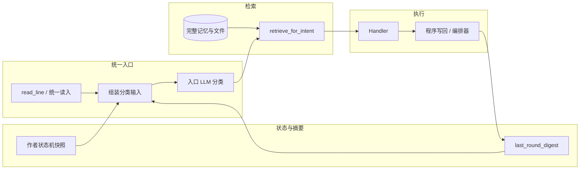
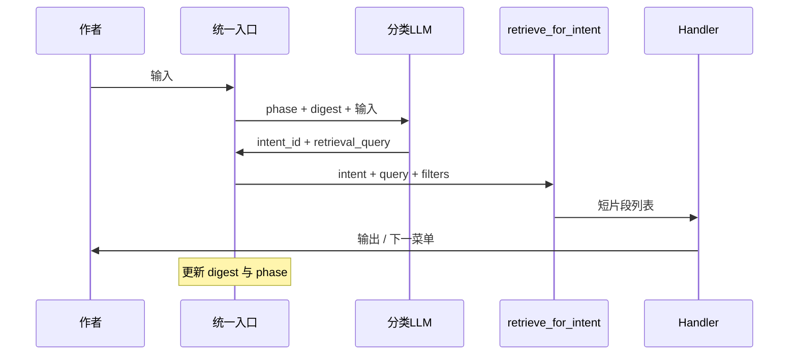

# 作者在环统一交互架构（专题方案）

本文档汇总 **统一入口、状态机、入口 LLM 分类、轮次摘要、按需检索** 的设计，作为实现与评审的单一事实来源（SSOT）。**目标态下「每一轮作者输入均经分类→检索→阶段策略」的完整 Harness 分层与迁移切片**见专题 **[author-agent-harness.md](./author-agent-harness.md)**。产品与回合理念仍以 [DESIGN.md](../../DESIGN.md) 为准；技术骨架见 [TECH_IMPLEMENTATION.md](../../TECH_IMPLEMENTATION.md) §6 作者在环。

**版本**：2026-03-29  
**状态**：方案已定，分阶段落地（见 §10）

---

## 1. 目的与范围

| 项 | 说明 |
|----|------|
| **目的** | 将「设定讨论、正文与审阅、写作前分析、书名/作品目录、其他自然语言输入」纳入 **同一套交互契约**：先判阶段与意图，再取上下文、再执行，避免重复 `input()`、散落菜单逻辑与上下文爆炸。 |
| **范围** | 主程序作者在环（CLI 首发）；不含 DevAgent、不含纯后台批处理。 |
| **非目标** | 一次 PR 替换所有现有交互；本方案允许 **渐进迁移**。 |

---

## 2. 背景与待解决问题

1. **多入口**：`design_phase`、`cli.review_*`、`run_novel_with_author` 中裸 `input()` 与各自 `_prompt` 并存，难以测试与扩展。
2. **缺前置条件**：例如未绑定当前作品时需 **引导交互**，不宜在配置/路径层用 **抛异常** 作为唯一反馈。
3. **上下文爆炸**：若把多轮对话、全量日志、全部事件簿塞进「理解作者意图」的 LLM，成本高且易偏题。
4. **分类与阶段脱节**：已有 `classify_author_input`（面向**记忆目录**归类）与流程 **阶段** 未统一；需在 **入口** 增加「阶段约束下的意图分类」。
5. **检索时机**：分类结果确定后，再从 **完整记忆库** 中 **按需检索** 片段，供执行用 LLM 或规则逻辑使用。

---

## 3. 设计目标与原则

1. **统一入口**：所有面向作者的阻塞式读入经 **同一 API**（便于注入 `input_fn`、日志、遥测）。
2. **阶段优先**：用 **状态机** 描述「当前小说下作者处于哪一阶段」；意图分类 **必须** 结合当前状态（合法转移、合法意图集合）。
3. **轻上下文分类**：进入「分类 LLM」的只有 **短摘要 + 状态快照 + 本轮输入**，**禁止** 全量历史。
4. **摘要可审计**：「上一轮」指 **交互闭环 + 程序执行结果** 的 **结构化摘要**，可持久化、可回放。
5. **先分类、后检索**：分类输出 **意图/处理器键** 后，再 **检索** 完整上下文记忆中的相关片段。
6. **配置与代码分离**：用户可见话术、分类/执行用提示词模板 **外置**（YAML 或等价物），Handler 保持薄适配。

---

## 4. 总体架构（四层）



- **入口层**：读入 → 拼 **分类输入** → **分类 LLM**（或规则兜底）→ 结构化 `intent`。
- **状态与摘要层**：维护 **每小说** 状态机；每轮结束更新 **`last_round_digest`**。
- **检索层**：`intent` + 查询词 → 从 **事件簿 / 设定文件 / 作者归类记忆 / 大纲** 等取 **短片段**。
- **执行层**：调用现有能力（`discuss_freely`、`revise_turn_plan_*`、`review_turn_result`、`novel_identity` 等），执行后 **写回摘要**。

---

## 5. 统一会话对象：AuthorSession（概念模型）

**职责**：持有 `config_dir`、`project_root`、`runtime_config`、可选 `Orchestrator` 引用；提供唯一 **`read_line(prompt)`**；读写 **状态机** 与 **`last_round_digest`**。

**不要求** 首版即实现为单独类；可先以 **显式参数 + 小模块** 落地，再收敛为类。

**测试**：所有原 `input_fn` 注入点逐步改为经 **同一会话对象**，保证单元测试可模拟多轮输入。

---

## 6. 作者状态机（按当前小说）

### 6.1 作用域

- 状态绑定 **`current_novel`**（作品目录）存在时的 **slug/root**；未绑定前可使用 **`NOVEL_UNBOUND`** / **`BOOTSTRAP`** 等全局态。
- 与「初稿 `draft-*`、书名终态化」流程对齐，见 [planning/next-iteration.md](../planning/next-iteration.md) 任务 E。

### 6.2 状态示例（可扩展）

| 阶段 ID | 说明 |
|---------|------|
| `NOVEL_UNBOUND` | 尚未通过交互创建/选择作品 |
| `BOOTSTRAP` | 新小说引导中（最小 world/characters 等） |
| `DESIGN_MAIN` | 设定阶段主菜单（对应现 `run_design_phase` 外层循环） |
| `DESIGN_DISCUSSION` | 设定自由讨论子循环 |
| `TITLE_CONFIRM` | 书名/终态化确认（`novel_identity`） |
| `MAIN_WRITING` | 正文回合内 |
| `TURN_PLAN` | 写作前分析确认与修订循环 |
| `TURN_REVIEW_P1` | 阶段一：回合结果审阅 |
| `TURN_REVIEW_P2` | 阶段二：记忆写回审阅 |

### 6.3 持久化建议

- 路径优先：`<novel_root>/config/author_state.yaml`（或并入 `meta.yaml` 的嵌套字段）。
- 未绑定小说时：可仅存于 `config/author_session_state.yaml` 或内存 + `design_session` 扩展字段（实现时二选一，避免重复）。

### 6.4 提供给分类 LLM 的快照

仅 **短 JSON**，例如：

```json
{
  "phase": "DESIGN_MAIN",
  "subphase": null,
  "flags": {
    "has_unsaved_discussion": false,
    "setting_research_trigger": "design_only"
  }
}
```

**禁止** 把完整会话事件数组塞进分类 prompt。

---

## 7. 上一轮摘要：`last_round_digest`

### 7.1 含义

- **不是** 全量对话日志。
- **是** 上一轮「作者交互 + 程序执行结果」的 **压缩摘要**，供 **下一轮入口分类** 使用。

### 7.2 建议字段（JSON 或等价）

| 字段 | 说明 |
|------|------|
| `interaction` | 作者做了什么（选菜单键 / 一句自然语言 / 空） |
| `system_response` | 系统如何响应（展示菜单名、生成失败、进入子循环等） |
| `execution` | 程序侧结果：写入了哪些路径、是否调用编排器、关键参数（scope/time、是否生成正文） |
| `open_issues` | 未决项（可选，短列表） |
| `updated_at` | ISO 时间 |

### 7.3 更新时机

- 每次 Handler **正常返回** 或 **用户显式保存** 后更新。
- 首回合可为空对象或固定占位。

### 7.4 长度与生成方式

- **目标**：分类侧总输入可控（例如 digest 部分 ≤ 500～800 汉字或等价 token 预算）。
- **首版**：规则模板拼接；**演进**：小型 LLM 将「原始轨迹」压成 digest（与分类 LLM 解耦）。
- **实现**：`src/author_loop/digest_compress_llm.py` 在 `AuthorSession.record_round_digest` 中调用；`runtime.author_interaction.digest_llm_compress` 为 `false` 时跳过 LLM、完整落盘；DummyLLM 时同样保留原文。

---

## 8. 入口 LLM：作者输入分类

### 8.1 输入（严禁全量历史）

1. **作者本轮原话**（或菜单选择原文）。
2. **`phase` 快照**（§6.4）。
3. **`last_round_digest`**（§7）。
4. **合法意图白名单**（由状态机 **生成** 的短列表，供模型对照）。

### 8.2 输出（结构化）

建议 Schema（实现可用 JSON Schema / Pydantic 校验）：

| 字段 | 类型 | 说明 |
|------|------|------|
| `intent_id` | string | 与内部 `Handler` 或路由表键一致 |
| `confidence` | number | 0～1，低于阈值则澄清一轮 |
| `retrieval_query` | string | 供 §9 检索用短查询（可与现 `classify_author_input` 的 `retrieval_query` 对齐） |
| `needs_clarification` | boolean | 是否反问作者 |
| `internet_search_needed` | boolean（可选） | 设定讨论：**按需**是否追加外网摘要；与 `runtime.author_harness.internet_search.require_classifier_signal` 配合 |
| `internet_query` | string（可选） | 外网搜索短句；空则沿用 `retrieval_query` |

### 8.3 兜底

- **DummyLLM / 失败**：规则映射（例如仅识别单字母菜单 `y/e/c/p`）或默认 `FALLBACK` → 展示当前阶段帮助文本。
- **设定讨论 LLM 传输超时**：`discuss_freely` 在判定为底层读/连接等超时后，向作者提示第几次超时与剩余次数；**y／回车** 再发起请求，**n** 放弃本轮；至多 **4** 次超时（默认 **budget=3** 次追加尝试，见 `src/llm/call.py` 中 `llm_invoke_with_transport_timeout_retry`）。
- **设定讨论联网（常见写法）**：`DESIGN_DISCUSSION` 下除显式「上网搜」与套路/模版关键词外，若作者表达**对齐常规等级、市面常见档位**（或并列多阶名等），规则与分类 LLM 路由可置 `internet_search_needed`；`internet_query` 后缀按 **用户用语 + config/design_session.yaml 的 genre/theme** 收窄（西幻/都市/科幻/修仙等分列检索域），避免非修仙语境误贴「修仙」检索词。

### 8.4 与现有 `classify_author_input` 的关系

| 能力 | 用途 |
|------|------|
| **入口 `classify_intent`**（新） | **流程阶段 + 意图** → 路由 Handler |
| **`classify_author_input`**（现有） | 作者补充要求 → **记忆目录** 落盘（`entries.md`） |

二者可并存；后续若合并，应保持 **「流程分类」与「记忆分类」** 输出字段分离，避免单模型过载。

---

## 9. 分类后检索与执行

### 9.1 流程



### 9.2 检索源（示例映射）

| `intent` 类型 | 主要检索源 |
|---------------|------------|
| 设定补充/讨论 | `setting_research_output`、`<book>/setting/*.md`、world 片段 |
| 回合正文/审阅 | 最近 scope 事件、当前 `TurnResult`、`TurnPlan` |
| 记忆/约束 | `author_classified_memory` 各分类 `entries.md` |
| 作品元数据 | `current_novel`、`meta.yaml` |

### 9.3 执行

- Handler **仅接收**：检索片段 + 必要运行时参数 + `runtime_config`。
- 复用现有：`discuss_freely`、`run_design_phase` 内核、`review_turn_result`、`generate_turn_body` 等。

### 9.4 设定讨论：`retrieval_profile` 与 Assembler `layout`

**`c` 自由讨论**与**设定主菜单**共用 `retrieve_for_intent`，但检索形态与 prompt 排版不同；实现以 **profile → layout** 成对映射，避免主菜单整段 YAML 与讨论链混用。

| 环节 | 主菜单（Harness / `DESIGN_MAIN`） | 自由讨论（`_assembled_context_for_discussion`） |
|------|-----------------------------------|------------------------------------------------|
| **检索 profile** | `default`（`RETRIEVAL_PROFILE_DEFAULT`） | `design_discussion`（`RETRIEVAL_PROFILE_DESIGN_DISCUSSION`） |
| **片段形态** | 整段 `world` / `setting_research` YAML + 至多 3 篇 `book/setting/*.md` | **不省略数据源**：`world` 摘要 + YAML **结构化提要**（`#摘要`）+ 多归档 `.md` **行级压缩**（至多 12 篇，剔除空壳占位行）+ 可选外网摘录 |
| **Assembler** | `assemble_retrieval_prompt_block(snippets)`（`layout="default"`） | `assemble_retrieval_prompt_block(snippets, layout="design_discussion")` → `format_snippets_design_discussion` |
| **排版** | `【来源】\n正文` 并列块 | **「归档摘录」**导引 + **①～④** 分层标题（世界 → YAML 提要 → 归档 md → 外网）+ 固定阅读顺序 |
| **下游** | `session.extra["intent_retrieval"]` 等 | `discuss_freely(..., assembled_context=..., compressed_retrieval_is_canonical=True)`；任务段含 **通用范式优于空想** 与 **回复体例**（先对齐各层，再分条列可归档条款） |

**与 D8 关系**：本条为设定讨论链路上的 **检索侧压缩 + 组装侧分层**（可视为 D8 在 `DESIGN_DISCUSSION` 的局部预演）；全意图 **Compression Contract（CC-b～）** 仍见 [context-compression-adaptive-layered.md](./context-compression-adaptive-layered.md)。

---

## 10. 提示词与 Handler 注册

- **提示词目录**：建议 `config/author_prompts.yaml` 或 `prompts/author/` 下分文件，键为 `phase` / `scene`。
- **Handler 注册表**：`intent_id` → 可调用函数；**薄封装**，业务逻辑仍在现有模块。
- **版本化**：模板变更建议与 `author_state` 或应用版本号关联，便于回放与调试。

---

## 11. 主流程顺序（与作品绑定）

为避免「设定产出需要作品目录却尚未绑定」：

1. **推荐**：在 `setting_research.trigger == design_only` 时，**先** 经交互完成 **作品存在性**（新建初稿或选择作品，与 `novel_bootstrap` / `novel_identity` 一致），**再** 进入完整设定交互。
2. **设定产出路径**：`<novel_root>/config/setting_research_output.yaml`（与现有小说级 world/characters 一致）。
3. **缺作品**：走 **交互引导**，不在配置库函数中 **抛异常** 作为唯一路径（库函数可返回 `Optional` 或由上层路由处理）。

### 11.1 门禁与设定审阅展示（与实现对齐）

下列为 **`run_novel_with_author` → `run_design_phase`** 路径上已实现行为，便于与 SDD 对照、避免「文档未写却依赖展示」。

| 项 | 约定 |
|----|------|
| **作品目录先于设定 UI** | `setting_research.trigger == design_only` 时，先 **`ensure_current_novel_for_design_phase`**（必要时 **`prepare_new_novel_if_needed`** 建 `draft-*`）；仍失败则 **`interactive_resolve_novel_for_design_phase`**（新建初稿 / 绑定目录 / 退出）。无有效 `current_novel.root` 时**不**进入 `run_design_phase`。 |
| **设定产出路径** | `<novel_root>/config/setting_research_output.yaml`（与 world/characters 同级 `config`）。 |
| **审阅区「预览」≠ 配置已固化** | `world.yaml` 中 **`world.name` 仍空** 时，日志中的「世界/时代」行可用 **`setting_research_output` 的 `theme` / `genre`** 作**只读预览**，并提示须 **c** 归纳或 **e** 写入 `world.yaml`。**`is_world_config_empty` 仍以 `world.name` 为准**；基础门闩（不可直接 **y** 结束设定）不变。 |
| **范围/角色占位与 reference** | 全局 `example_*.yaml` 中的「绑定小说目录后…」与初稿 **`novel_bootstrap._minimal_*`** 的「待设定…」等占位，在已存在 **`reference`** 时，审阅区可用梗概替换展示，避免误以为未加载上一轮设定研究产出；**不自动写回** `world.yaml` / `characters.yaml`。 |
| **实现位置** | `src/author_loop/novel_bootstrap.py`、`novel_identity.py`（初稿与指针）；`design_phase.py`（`_format_world_summary` / `_format_scopes_summary` / `_format_characters_summary` 与占位片段常量）。 |

---

## 12. 与现有代码映射（落地参考）

| 现有模块 | 迁移角色 |
|----------|----------|
| `author_loop/design_phase.py` | 拆为状态 + Handler；菜单与自然语言统一经入口分类 |
| `author_loop/cli.py` | `review_*` 使用统一 `read_line` 与 phase |
| `run_novel_with_author.py` | 回合内裸 `input()` 迁入 `TURN_PLAN` / `TURN_REVIEW_*` Handler |
| `author_loop/novel_identity.py` | `TITLE_CONFIRM` / 绑定 gate |
| `author_classified_memory.py` | 检索源之一；`classify_author_input` 保留或并入「记忆写回」路径 |
| `config/__init__.py` | `special_settings_config_dir`：未绑定时 **Optional + 上层引导**，与本文 §11 一致 |

---

## 13. 迁移路线图（建议分阶段）

| 阶段 | 内容 | 验收 |
|------|------|------|
| **M1** | `AuthorSession` 雏形 + 统一 `read_line`；一处现有模块改用 | 单测可注入多轮输入 |
| **M2** | `author_state` + `last_round_digest` 持久化结构；规则生成 digest | ✅ 已实现：`src/author_loop/author_interaction_state.py` + `AuthorSession.record_round_digest`；落盘 `author_interaction_state.yaml` |
| **M3** | 入口 `classify_intent` + 白名单；Dummy 兜底 | ✅ `classify_intent.py`；`DESIGN_MAIN` 白名单 + LLM；`intent_classify_llm: false` 时仅规则；`design_phase` 主菜单已接入 `design_main_menu_key` |
| **M4** | `retrieve_for_intent` 最小实现（1～2 类意图） | ✅ `retrieve_for_intent.py`：设定类与保存类两路；总长度可配；`AuthorSession.extra` 供后续 Handler 注入 |
| **M5** | 吞并 `run_novel_with_author` 主循环输入 | ✅ `for_main_loop` + `main(input_fn=)`；书名确认 `confirm_title` 与审阅/补充设定同 `read_line`；重载编排器后刷新 `runtime_config` |
| **M6** | LLM 压 digest（可选） | ✅ `digest_compress_llm.py` + `record_round_digest`；可关 `digest_llm_compress`；**可选**：token 硬上限与质量评审 |

---

## 14. 风险与开放问题

- **分类错误**：依赖 `confidence` + 澄清轮；关键操作（写回、删文件）需 **确认**。
- **状态与多进程**：单作者单会话假设；若未来 Web 多会话，需会话 ID。
- **检索质量**：需分页与去重，避免 Handler 再次撑爆上下文。
- **与大纲/成长状态机**：阶段枚举将来可能与 `outline-and-beats.md`、`character-growth-state-machine.md` 交叉，宜在 `author_state` 预留扩展字段。

---

## 15. 相关文档

- [DESIGN.md](../../DESIGN.md) — 产品与协作设计  
- [TECH_IMPLEMENTATION.md](../../TECH_IMPLEMENTATION.md) — §6 作者在环  
- [memory-storage-and-retrieval.md](./memory-storage-and-retrieval.md) — 存储与检索  
- [planning/next-iteration.md](../planning/next-iteration.md) — 任务 E、迭代清单  
- [specs/author-in-loop-spec.md](../specs/author-in-loop-spec.md) — 作者在环 **L1 行为规约**（MUST/SHOULD/不承诺）  
- [author-agent-harness.md](./author-agent-harness.md) — 统一入口 Agent Harness（**L2 SDD**）、工具与 Prompt 组装、迁移切片  
- [outline-and-beats.md](./outline-and-beats.md)、[character-growth-state-machine.md](./character-growth-state-machine.md) — 长期与阶段交叉时查阅  

---

## 16. 修订记录

| 日期 | 说明 |
|------|------|
| 2026-05-01 | §9.4：设定讨论 `retrieval_profile=design_discussion` 与 Assembler `layout=design_discussion` 成对映射；§8.3 增补讨论超时重试与按 genre/theme 收窄联网 |
| 2026-03-29 | 初版：统一入口、状态机、digest、入口分类、按需检索、迁移路线 |
| 2026-04-04 | §11.1：作品目录门禁、`setting_research_output` 审阅预览与占位规则（与 `design_phase` 实现对齐）；文首与 §15 互链 **author-agent-harness.md** |
| 2026-04-05 | §15 增加 **specs/author-in-loop-spec.md**（L1 行为规约）互链 |
