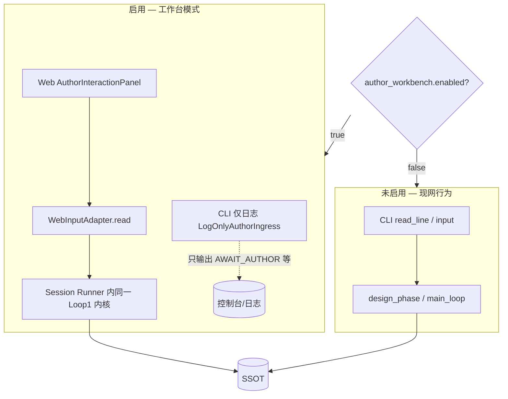

# 小说作者在环工作台（Novel Author Workbench）

**登记表 ID**：**D9**（L2 SDD）  
**状态**：文档闸 ✅（2026-06-14）；**2026-06-14（续）** 定位修订：阅览 + **作者在环交互**（与 CLI 同模型）  
**SSOT 关系**：数据落盘以 **D2** [memory-storage-and-retrieval.md](./memory-storage-and-retrieval.md) 为准；交互状态机以 **D1** [author-interaction.md](./author-interaction.md) + **S2** [author-in-loop-spec.md](../specs/author-in-loop-spec.md) 为准；Harness 管线以 **D6** [author-agent-harness.md](./author-agent-harness.md) 为准。  
**产品定位**：启用 **`author_workbench`** 时，作者在环 **唯一交互面** 为 Web 工作台；**CLI 不再读 stdin**，仅向控制台/日志文件 **输出** 阶段、Harness、待回复提示与写回结果。未启用工作台时，行为与现网一致（CLI 交互 + 日志）。

---

## 1. 背景与动机

当前 min-autobook 以 **CLI 作者在环**（`run_novel_with_author.py`、`run_design_phase`）为唯一交互面：作者在终端读提示、输入 `y/e/c/p` 或自然语言，经 **Harness（分类→检索→组装）** 驱动设定讨论与回合审阅。产出落在 `<novel_root>/book/` 与 `config/`，但 CLI 难以同时：

- **纵览** 大纲、章节进度、回合正文、设定三层、关系图、**各角色独立演进轨迹**；
- **按角色切换** 查看该角色自己的事件提炼、关系变化、目标/情感演进（对齐 DESIGN §4「角色 Agent 独立演进」）；
- **按角色对** 查看两人关系图谱、强度曲线与 `change_log` 证据链；
- **在阅览上下文中继续对话**——例如在某一章页面直接发起「本节拍怎么改」「战力体系再对齐一下」；
- 将 **设定讨论 `c`** 与 **正篇每回合审阅** 放在同一套可视化工作区，避免「看文件用编辑器、写作用终端」割裂。

本 SDD 定义 **Web 作者在环工作台**：阅览区 + **常驻交互区**（`WebInputAdapter` ↔ `read_line`）。**启用工作台后**，作者在环主循环 **仅** 在 `web/api` 的 Session Runner 内运行；CLI 入口改为 **日志旁路**（见 §5.5、§10）。

---

## 2. 目标与非目标

### 2.1 目标（SHOULD）

| # | 目标 |
|---|------|
| G1 | **阅览**：大纲树、章节/节拍进度、按 scope 的回合正文 |
| G2 | **阅览**：设定三层（world、setting_research、book/setting md） |
| G3 | **阅览·关系**：全书关系图谱；**以某角色为心的子图**；**双角色对关系专页**（边 + 双侧 change_log + 共现 turn） |
| G3b | **阅览·角色演进**：**每个角色独立一条演进时间线**（私有 events、关系变更、共现、目标/情感摘要；D4 后接五维成长） |
| G4 | **交互·设定阶段**：浏览器内等价 CLI **设定主菜单**（`y/e/c/p` 与自然语言直进 `c`）及 **自由讨论 `discuss_freely`** 多轮对话 |
| G5 | **交互·正篇阶段**：在 **当前章/节拍/回合** 上下文发起 **写作前分析确认、正文生成审阅、阶段一/二确认**（对齐 `review_turn_result` / `review_memory_plan`） |
| G6 | **Harness 同管线**：交互轮次经 **classify_intent → retrieve_for_intent → assemble**（设定讨论 profile/layout 与 CLI 一致） |
| G7 | **会话同模型**：`AuthorSession` + `phase` + `last_round_digest`；Web 替换 **传输层**（`read_line` ↔ API） |
| G8 | API **委托**既有 `src/runtime/*`、`src/author_loop/*`、`src/author_harness/*` |
| G9 | **运行模式**：`author_workbench.enabled=true` 时 **禁止 CLI stdin**；作者在环 **仅 Web** |
| G10 | **系统设置**：`/system` 入口可查看/编辑分层 runtime（LLM、工作台、联网、作者在环），规则同 `load_runtime_config` |

### 2.2 非目标（本阶段不承诺）

| # | 非目标 |
|---|--------|
| N1 | 多用户鉴权、并发写锁、公网 SaaS 部署（首期 **本地单用户单会话**） |
| N2 | 向量语义检索、全文搜索引擎 |
| N3 | 在 **D4 成长状态机未实现** 前提供真实五维成长写回（UI 占位 + 代理指标） |
| N4 | 无审阅门闩的「一键自动写满全书」 |
| N5 | 工作台启用时仍从 **第二个终端** 用 stdin 驱动同一本书（**禁止**；须关工作台或仅用 Web） |

---

## 3. 用户角色与场景

| 角色 | 场景 |
|------|------|
| **作者** | 在「第 2 章 · 节拍 b2」页阅读已写正文，在底部交互区输入修改意见 → 触发审阅修订（同终端 `review_turn_result`） |
| **作者** | 在设定库页就「境界体系」与 Agent 多轮讨论（同 `c` / `discuss_freely`），满意后归纳写回 |
| **作者** | 在 **角色演进** 页切换「林远」，只看该角色视角下的事件与关系变化，不与其他角色时间线混排 |
| **作者** | 打开 **林远—苏婉** 关系专页，看两人关系类型、强度曲线、每次变疏/变密的 turn 证据 |
| **开发者** | `enabled=true` 时跑 `run_novel_with_author`：终端只见 `[作者在环]` 日志，无 `input()`；交互在浏览器完成 |

**核心用户故事**：

1. 作为作者，我选择作品，看到大纲树与 **当前交互 phase**（`DESIGN_MAIN` / `MAIN_WRITING` / `TURN_REVIEW` 等）。  
2. 作为作者，我在 **设定工作台** 输入想法（等价 `c`），看到 Agent 回复与 **归档摘录** 侧栏，可多轮直到「满意」并归纳。  
3. 作为作者，我在 **章节工作台** 看到本回合写作前分析，点选同意或输入补充要求（同终端确认流）。  
4. 作为作者，我审阅生成的正文，输入 `y` 或自然语言反馈（同 `understand_author_review_intent` 分流）。  
5. 作为作者，我打开 **角色列表**，点进任一角色，看到其 **独立演进时间线**（该角色所知事件、关系、情感变化，按 turn 展开）。  
6. 作为作者，我打开 **关系图谱**，可切换「全书 / 以某角色为心 / 指定两人对」，并下钻到 **关系变更时间轴**。  
7. 作为作者，我在角色或关系页用交互区追问「此时林远知道什么」「两人为何敌对」→ Harness 检索后回复。  
8. 作为作者，我在 **系统设置** 里打开联网检索、调高 LLM timeout，保存后下一轮讨论即按新配置生效。  
9. 作为作者，我浏览设定、正文的同时，**不必切换回终端** 完成讨论与审阅。

---

## 4. 数据 SSOT 与目录映射

绑定作品后 `<novel_root>` = `runtime.storage.data_root`（通常 `data/novels/<slug>/`）。

```
<novel_root>/
├── meta.yaml
├── config/
│   ├── world.yaml
│   ├── characters.yaml
│   ├── setting_research_output.yaml
│   ├── runtime.yaml
│   └── author_interaction_state.yaml
└── book/
    ├── outline/outline.yaml          # 章纲 SSOT
    ├── outline/progress.yaml         # 写作进度指针（MVP-2 写回待完善）
    ├── events/<scope_id>/events/turn_NNNN.md   # 范围回合：摘要+正文 SSOT
    ├── characters/<id>/events/turn_NNNN.md     # 角色视角回合（若有）
    ├── setting/*.md                  # 设定归档
    ├── relationships/graph.yaml      # 关系图 SSOT
    └── memory/author_classified/...  # 作者归类记忆（远期 Tab）
```

| UI 概念 | SSOT | Python 模块（API 应委托） |
|---------|------|---------------------------|
| 作品列表 | `data/novels/index.yaml`、`config/current_novel.yaml` | `config.current_novel_root` |
| 大纲 | `book/outline/outline.yaml` | `outline_store.load_outline_snapshot` |
| 进度 | `book/outline/progress.yaml` | 同上 |
| 回合正文 | `book/events/<scope>/events/turn_*.md` | `file_sync.load_scope_events_from_disk` |
| 设定 YAML | `config/*.yaml` | `config.load_world_config` 等 |
| 设定 md | `book/setting/*.md` | 直读文件 |
| 角色独立演进 | `book/characters/<id>/events/turn_*.md`；运行时 `MemoryStorage` profile/relations/emotions（见 D2 §2.2） | `file_sync` + 未来 `character_growth`；timeline 服务聚合 |
| 角色成长（远期） | `book/characters/<id>/growth_state.yaml` | D4 `CharacterGrowthState` |
| 关系图（全书） | `book/relationships/graph.yaml` | `relationship_graph.load_graph` |
| 关系（角色心子图） | 同上，客户端或 API 按 `center_id` 过滤 1～2 跳邻居 | `get_neighbors` |
| 关系（角色对） | 同上，`get_relation(a,b)` + 双侧 `change_log` | `get_relation_change_log` |

**重要语义**：系统持久化粒度是 **回合（turn）**，不是「一章一文件」。UI 的「章视图」为 **聚合视图**，规则见 §6。

---

## 5. 信息架构（IA）与导航

### 5.1 应用壳（App Shell）

**双区布局**：上/左为 **阅览区**（SSOT 材料），下/右为 **作者在环交互区**（等价终端）。

```
┌─────────────────────────────────────────────────────────────────────────┐
│ [作品▼]  书名 · phase: DESIGN_DISCUSSION │ ch02/b2 │ scope [京城▼]      │
├──────────┬──────────────────────────────────────────────┬───────────────┤
│ 侧栏     │  阅览主区（大纲/正文/设定/关系/角色）            │ 上下文抽屉     │
│ · 概览   │                                              │ 归档摘录/检索源 │
│ · 大纲   │                                              │               │
│ · 章节●  │                                              │               │
│ · 设定   │                                              │               │
│ · 关系   │                                              │               │
│ · 角色   │                                              │               │
│ · 系统⚙  │  （侧栏项，路由 `/system`，见 §5.6）            │               │
├──────────┴──────────────────────────────────────────────┴───────────────┤
│  【作者在环交互区】  顶栏 [⚙] 亦可进入系统设置                              │
│          │  ┌─ 系统提示/菜单 ─────────────────────────────────────┐   │
│          │  │ 满意后请输入 y 保存，或继续讨论…                        │   │
│          │  └────────────────────────────────────────────────────┘   │
│          │  [ 作者输入…                              ] [发送] [y][n]  │
│          │  对话历史 · LLM 流式 · 超时重试确认（同 discuss_freely）    │
└──────────┴─────────────────────────────────────────────────────────────┘
```

- **交互区常驻**：任意阅览页均可输入；`phase` 决定合法意图与快捷键（`y/e/c/p` 芯片）。  
- **章节页增强**：交互区顶栏显示 **本章 dramatic_question、beat intent、当前 turn**，作者讨论默认带 `retrieval_query` 上下文（章 id + 用户句）。

### 5.2 一级页面

| 路由 | 页面 | 阅览 | 交互（等价 CLI） |
|------|------|------|------------------|
| `/` | 概览 | meta、progress、最近 turn、关系快照 | 继续上次 phase / 选「进入设定」或「继续正篇」 |
| `/outline` | 大纲与目录 | 卷/章/节拍树 | 选中章/节拍后讨论「本章承担功能」 |
| `/chapters` | **章节工作台** | turn 列表 + 阅读器 | **本回合/本章** 写作前分析、正文审阅、补充要求（主场景） |
| `/settings` | **设定工作台**（小说内容） | 世界/设定研究/归档 md | **主菜单 c**、多轮讨论 |
| `/system` | **系统设置** | 分层配置表单 + 生效预览 | 保存后提示是否重启 Session |
| `/relationships` | **关系图谱** | 全书图 / **以角色为心子图** / 表视图 | 针对边或角色对追问 |
| `/relationships/pair/:a/:b` | **双角色关系专页** | 边详情 + 强度曲线 + 共现 turn + 双侧时间轴 | 「解释 A—B 为何变化」 |
| `/characters` | **角色列表** | 卡片：出场 turn 数、关系边数、最近变更 | 进入某角色演进 |
| `/characters/:id` | **单角色独立演进** | 该角色专属时间线（不与其他角色混排） | 「该角色此时知道什么」 |
| `/characters/:id/graph` | 角色心关系子图 | 以 `:id` 为中心的邻居与边 | 点击邻居跳转 pair 页 |

### 5.3 跨页联动

- 大纲树点击章/节拍 → `/chapters?chapter_id=&beat_id=`，交互区预填「讨论第 N 章」  
- 设定卡片点击方向 → `/settings?direction=power_system`，交互区进入 `DESIGN_DISCUSSION`  
- 角色列表点击 → `/characters/:id`（**独立演进**，默认非对比模式）  
- 角色页「查看与 X 的关系」→ `/relationships/pair/:id/:x`  
- 关系图选中边 → `/relationships/pair/:a/:b`  
- 关系图「以该角色为心」→ `/characters/:id/graph` 或 `/relationships?center=:id`

### 5.4 交互状态机（与 D1 对齐）

Web 会话服务端持有与 CLI 相同的 **`AuthorSession`** 与 **`author_interaction_state.yaml`**。前端 **不维护** 独立业务状态机，只渲染：

| 字段 / 事件 | 来源 | UI |
|-------------|------|-----|
| `phase` | `AuthorPhaseState` | 顶栏徽章 |
| `pending_prompt` | `WebInputAdapter` 队列 | 交互区提示框 |
| `choices` | 解析菜单行（`y/e/c/p`） | 快捷芯片 |
| `conversation_turn` | discuss_freely / 审阅历史 | 对话气泡 |
| `retrieval_block` | `assembled_context` | 侧栏「归档摘录」 |
| `timeout_retry` | `llm_invoke_with_transport_timeout_retry` | 模态：是否继续（y/n） |

**阶段映射**：

| CLI 入口 | Web phase 展示 | Handler 内核 |
|----------|----------------|--------------|
| `run_design_phase` 主菜单 | `DESIGN_MAIN` | `classify_intent` + 菜单分支 |
| `_run_freestyle_discussion` | `DESIGN_DISCUSSION` | `discuss_freely` |
| `run_novel_with_author` 回合循环 | `MAIN_WRITING` / `TURN_PLAN` / `TURN_REVIEW_*` | `review_turn_result` 等 |
| `review_memory_plan` | `MEMORY_PLAN_REVIEW` | 阶段二记忆确认 |

### 5.5 运行模式与配置（`author_workbench`）

| `runtime.author_workbench.enabled` | CLI（`run_novel_with_author` / 设定入口） | 作者在环循环跑在哪 |
|-----------------------------------|------------------------------------------|-------------------|
| **`false`**（默认，工作台未落地前） | **完整交互**：`AuthorSession.read_line` / `input()` | CLI 进程 |
| **`true`** | **仅日志**：打印阶段、菜单 prompt、Harness 字段、写回路径；**不**读 stdin | **`web/api` Session Runner** + `WebInputAdapter` |

**配置示例**（小说级 `runtime.yaml` 或 `system_config` 合并）：

```yaml
runtime:
  author_workbench:
    enabled: false
    url: "http://127.0.0.1:8765"   # 启用时 CLI 启动提示打开此地址
    api_port: 8765
```

**CLI 启用工作台时的行为（MUST）**：

1. 启动时打印：`作者在环交互已迁至工作台 → {url}`。  
2. **不**调用阻塞式 `input()` / `read_line` 等待作者；待回复 prompt 以 **`[作者在环] AWAIT_AUTHOR`** 级别日志输出（正文同原菜单/提示文案）。  
3. **不**在 CLI 进程内启动 `run_design_phase` / 主回合 `while` 循环（避免与 Web Session Runner 双写）。  
4. 可选：CLI 仅负责拉起 `uvicorn web.api` 子进程并 **follow 日志**（实现细节 W3）。

**Web 启用工作台时的行为（MUST）**：

1. Session Runner 以 `input_fn=WebInputAdapter.read` 调用既有 `run_design_phase` / `run_novel_with_author.main`。  
2. 同一时刻 **至多一个** 活跃 Session 绑定一本 `data_root`（文件锁或 409 冲突）。  
3. 超时重试、Harness 检索、写回门闩与 CLI 时代 **完全一致**（S2）。

**`LogOnlyAuthorIngress`（实现名，W3）**：供 CLI 路径在 `enabled=true` 时替换原 `main(input_fn=...)`——只配置 logging、打印 `[大纲进度]` 等既有 INFO，然后 **return** 或进入 **无交互** 的「等待 Web 会话」占位（不抢 stdin）。

### 5.6 系统设置（`/system`）

**入口**：侧栏 **「系统设置」**、顶栏 **⚙**；与 **设定工作台** `/settings`（小说世界观内容）**分离**。

**配置分层**（与 `load_runtime_config` 一致，UI 须标明写入落盘文件）：

| 层级 | 落盘路径 | 可编辑字段（示例） |
|------|----------|-------------------|
| **全局** | `config/system_config.yaml` | `framework.llm`、`framework.llm_options`（model/base_url/timeout/max_retries）、`debug.*` |
| **项目 runtime** | `config/novel_writing.yaml` 并入 `runtime` 的段 | `author_interaction.*`、`runtime.storage.data_root` 等 |
| **当前小说** | `<novel_root>/config/runtime.yaml` | `author_harness.internet_search`、`author_workbench`、小说级 timeout 覆盖 |

**分组 Tab（首期）**：

| Tab | 配置键 | UI 控件 |
|-----|--------|---------|
| **工作台** | `runtime.author_workbench` | `enabled` 开关、`url`/`api_port` 只读展示、启用说明（CLI 仅日志） |
| **LLM** | `framework.llm`、`framework.llm_options` | 模型下拉/文本、timeout、max_retries；`api_key_env` **仅显示变量名** + 「环境变量是否已设置」指示灯（**不**展示密钥） |
| **联网检索** | `runtime.author_harness.internet_search` | `enabled`、`provider`、`max_chars`、`timeout_ms`、`max_results`、`require_classifier_signal`；Playwright 依赖状态（chromium 是否可用） |
| **作者在环** | `runtime.author_interaction` | `intent_classify_llm`、`retrieve_max_total_chars`、`digest_llm_compress` |
| **高级** | `debug.*`、`dev_agent.enabled`（可选） | 折叠区；改后提示重启 Session |

**交互规则**：

1. **读取**：`GET /system/config` 返回 **合并后生效值** + 每项 `source`（`system` / `novel_writing` / `novel_runtime`）。  
2. **保存**：`PATCH /system/config` 带 `scope: global | novel`；只写允许的白名单键；YAML 原子写盘 + 校验失败 400。  
3. **生效**：变更 `author_workbench.enabled` 或 LLM 相关键后，提示 **「结束当前 Session 并重新创建」**（W3+ 可一键 `DELETE /session` + 重建）。  
4. **安全**：禁止通过 API 写入 `api_key` 明文；密钥仍只来自环境变量。本地单用户，无鉴权，但 UI 警示勿暴露到公网。

**与联网能力**：系统设置是作者开启 `internet_search.enabled` 的 **主入口**（无需手改 YAML）；保存后下一轮 `retrieve_for_intent` 即按新配置门闩执行。

---

## 6. 章视图与 turn 聚合规则

### 6.1 问题陈述

`outline.yaml` 定义 **规划态** 章/节拍；`turn_*.md` 记录 **已写回合**。二者无落盘级 FK；`progress.yaml` 仅指向 **当前** 写作位置。

### 6.2 聚合策略（分阶段）

| 阶段 | 规则 | 准确度 |
|------|------|--------|
| **W2 启发式** | 取 `progress.chapter_id` / `beat_id` 之前所有 turn（按 scope 全局序）归入「已完成章」；当前章归入 `progress` 所在章；未写章为空 | 中；适合 MVP |
| **W3 显式映射** | 扩展 `progress.yaml` 或 turn md front matter：`chapter_id`、`beat_id`（MVP-2 写回时写入） | 高 |
| **W3+ 多 scope** | 按 `beat.suggested_scope_id` 过滤 scope 下 turn | 高 |

**W2 默认算法（Read API `GET /chapters/{id}/turns`）**：

1. `flat_chapters = OutlineSnapshot._flat_chapters()` 得有序章列表。  
2. 若 `progress` 存在：`current_chapter_index = index(progress.chapter_id)`。  
3. 对目标 `chapter_id`：  
   - 若 `index(chapter_id) < current_chapter_index`：该章状态 `done`，turns = scope 下 **到该章结束边界** 的回合（W2 可用「按章序号均分 turn」或「全部归入当前章之前」的保守策略，须在 API 响应标注 `mapping_confidence: low`）。  
   - 若 `chapter_id == progress.chapter_id`：turns = 最近 `progress.turns_in_beat` 相关 scope turn + 当前节拍之后的同 scope turn。  
   - 若章节在后：空列表，`status: planned`。  
4. 响应字段 **`aggregation_meta`**：`strategy: heuristic_v1`、`warnings: []`。

> **依赖**：精确章↔turn 映射以 **大纲 MVP-2** `progress.yaml` 写回与可选 turn 标注为准；UI 须在低置信度时展示「映射为估算」徽章。

---

## 7. 页面设计细则

### 7.1 概览 Dashboard

| 区块 | 数据 | 展示 |
|------|------|------|
| 作品卡 | `meta.yaml` | 书名、slug、status、data_root |
| 写作进度 | `progress.yaml` + outline | 当前章标题、beat intent、`turns_in_beat / soft_max` |
| 最近正文 | 最近 3 turn | 摘要首行 + 跳转 |
| 设定摘要 | `world.name`、`setting_research.genre/theme` | 一行梗概 |
| 关系快照 | `graph` 高强度边 Top5 | 迷你邻接列表 |

### 7.2 大纲与目录

**左树**（可折叠）：

```
▼ 第一卷 vol1
  ▼ 第1章 ch01 开端  [done]
      · b1 节拍意图…  [done]
      · b2 …           [active]
  ▶ 第2章 ch02 …      [planned]
```

- 节点徽章：`planned | active | done`（来自 outline beat.status 与 progress 合并）  
- **右栏**：`dramatic_question`、`beat.intent`、`suggested_scope_id`、`character_hooks`  

### 7.3 章节工作台（正篇交互主场景）

**阅览**：`turn_index`、`time`、`place`、摘要；阅读器 Tab（摘要 / 正文 / 元数据）；scope 顶栏切换。

**交互（对齐 `run_novel_with_author` 单回合）**：

| 步骤 | 终端行为 | Web 交互区 |
|------|----------|------------|
| 写作前分析 | 展示 plan，问是否生成正文 | 卡片展示 plan +「同意生成」/ 补充要求 |
| 正文生成 | 展示 body | 正文预览 + 加载态 |
| 阶段一审阅 | `review_turn_result` | 芯片 y/n/e/s + 自然语言修订 |
| 阶段二记忆 | `review_memory_plan` | 步骤条确认 |

进入章节页时拉取 `GET /session/{id}/pending`；自然语言审阅 **必须** 经 Harness 检索（S2 §2.3）。

### 7.4 设定工作台（设定交互主场景）

**阅览**（归档摘录分层，见 D1 §9.4）：

| Tab | 来源 | UI |
|-----|------|-----|
| **① 世界** | `world.yaml` | name、era、scopes、brief |
| **② 结构化提要** | `setting_research_output.yaml` | 方向卡片 + 章节大纲表 |
| **③ 归档稿** | `book/setting/*.md` | 文件树 + Markdown |

**交互（对齐 `run_design_phase`）**：

| 步骤 | 终端 | Web |
|------|------|-----|
| 主菜单 | `y/e/c/p` 或长句直进 `c` | 菜单芯片 + 输入框 |
| 自由讨论 | `discuss_freely` | 对话线程 + 侧栏归档摘录 |
| 满意→归纳 | `summarize_and_extract_by_directions` | 「满意并归纳」 |
| 保存 | `p` / 「保存」 | 「保存进度」 |
| 超时重试 | `read_line` y/n | 模态确认 |

### 7.5 关系图谱（全书 · 以角色为心 · 角色对）

关系数据 SSOT：`book/relationships/graph.yaml`（节点 `id/name/tags`，边 `type/intensity/status/evidence_events/change_log`）。UI 提供 **三种视图**，底层同一图数据。

#### 7.5.1 全书视图（默认 `/relationships`）

- 力导向图：全部 `nodes` + `edges`（大书可限制 `min_intensity` 或仅 `active` 边）  
- 选中边 → 抽屉或跳转 **7.5.3 角色对专页**  
- 表视图：邻接表，筛选 `type`、`min_intensity`（对齐 `get_neighbors`）

#### 7.5.2 以角色为心子图（`/characters/:id/graph` 或 `?center=`）

- **中心节点**固定为当前角色，展示 **1～2 跳** 邻居（可配 `hop=1|2`）  
- 边样式突出 **与该角色相关** 的 `change_log` 最近一条摘要（悬停）  
- 用途：回答「林远此刻的社会网是谁、关系强弱如何」——不等同于全书图缩小，而是 **ego network** 语义

#### 7.5.3 双角色关系专页（`/relationships/pair/:a/:b`）

| 区块 | 内容 |
|------|------|
| **关系概览** | `type`、`intensity`、`status`；无向边展示（`a—b` 与 `b—a` 合并） |
| **强度曲线** | 按 `change_log[].turn` 采样 intensity（若 log 无历史强度则用阶梯近似） |
| **变更时间轴** | `change_log` 降序：每点含 `turn`、`reason`、可点进 scope/角色 turn |
| **共现回合** | `evidence_events` 与 `co_presence` 触发的 turn 列表 |
| **双侧对照（可选）** | 左列 A 在该 turn 的摘要要点，右列 B 的摘要要点（来自各自 `characters/<id>/events`） |

交互区可预填：「请根据上图证据解释 A 与 B 在 turn N 之后关系为何变化」。

### 7.6 角色独立演进（核心）

对齐 **DESIGN §4**：每个重要角色 **独立记忆、独立演进**；UI **默认按单角色一条时间线** 展示，不把多角色事件混在同一列表（对比模式除外）。

#### 7.6.1 角色列表（`/characters`）

| 列/卡片字段 | 来源 |
|-------------|------|
| 头像/名/id | `characters.yaml` + `graph.nodes` |
| 标签 | `tags`（主角/配角） |
| 出场 turn 数 | `characters/<id>/events/*.md` 或 scope 提及计数 |
| 关系边数 | `get_neighbors(id)` 计数 |
| 最近关系变更 | 涉及该 id 的最近一条 `change_log` |
| 成长快照（D4 后） | `growth_state` 五维摘要 |

#### 7.6.2 单角色演进页（`/characters/:id`）

**顶栏**：`角色 [ 当前 ▼ ]` · `[ 与某人关系 ▼ ]` 跳转 pair 页 · `对比模式` · `时间范围`

**独立演进时间线**（仅含 **该角色视角** 条目，按 `turn` 升序）：

| 轨道 | 含义 | 数据来源 |
|------|------|----------|
| **所知事件** | 该角色视角下发生的事（提炼/摘要） | `book/characters/<id>/events/turn_*.md`；缺省时回退 scope turn 中提及该角色的句子 |
| **关系变化** | 作为 source 或 target 的边 `change_log` @ turn | `graph.yaml` |
| **情感/目标（摘要）** | 对该角色有意义的情绪或目标变化 | 运行时 relations/emotions 落盘（D2）；远期 D4 `mind_state`/`goal_state` |
| **共现** | 与谁同场 | `co_presence` 边 @ turn |
| **成长迁移（D4）** | 五维 delta | `growth_state.transition_log` |

**设计原则**：

- 时间线 **只服务当前选中角色**；看另一角色须 **切换角色** 或开 **对比模式**，避免「一条时间线里穿插多角色 POV」造成与 Agent 独立记忆模型不一致。  
- 每个 turn 卡片可展开：**原始 md**、链接到 **章节工作台** 对应正文、链接到 **关系 pair 页**。

#### 7.6.3 双角色演进对比（可选模式）

```
[ 林远 ▼ ]  对比  [ 苏婉 ▼ ]   同步滚动
```

- 左右 **两条独立时间线**（各角色仍只含自身轨道）  
- 中间列：共同 `turn`、**A—B 边** 的 `change_log` 高亮  
- 底部迷你 **pair 关系子图**（7.5.3 缩略）

#### 7.6.4 代理指标（D4 前）

- 累计出场 turn、活跃关系边数、intensity 均值曲线、`change_log` 条数  
- 文案注明：完整五维成长见 D4 落地后 `growth_state.yaml`

---

## 8. API 设计（阅览 + 作者在环会话）

### 8.1 原则

- **Base URL**：`http://127.0.0.1:8765/api`  
- **阅览**：无状态 GET，直读磁盘 SSOT  
- **交互**：有状态 **Session**；单用户单活跃会话（首期）；**不得**绕过 S2 门闩  
- **实现**：`web/api/` 委托 `src/`；交互 Runner 线程内调用 `AuthorSession` + `input_fn=WebInputAdapter.read`

### 8.2 Phase A — 阅览 API（W1）

| 方法 | 路径 | 说明 |
|------|------|------|
| GET | `/novels` | 作品列表 + `current_slug` |
| GET | `/novels/{slug}` | meta、paths、scopes |
| GET | `/novels/{slug}/outline` | outline + progress + warnings |
| GET | `/novels/{slug}/scopes/{scope_id}/turns` | 分页 turn 元数据 |
| GET | `/novels/{slug}/scopes/{scope_id}/turns/{n}` | 单 turn 摘要+正文 |
| GET | `/novels/{slug}/chapters` | 章列表 + status |
| GET | `/novels/{slug}/chapters/{chapter_id}/turns` | §6 聚合 |
| GET | `/novels/{slug}/settings/world` | world.yaml |
| GET | `/novels/{slug}/settings/research` | setting_research_output |
| GET | `/novels/{slug}/settings/md` / `.../{name}` | 归档 md |
| GET | `/novels/{slug}/graph` | 全图 nodes + edges |
| GET | `/novels/{slug}/graph/subgraph` | query: `center_id`、`hop=1|2`、`types`、`min_intensity` → 以角色为心子图 |
| GET | `/novels/{slug}/graph/pair` | query: `a`、`b` → 边 + change_log + evidence + 共现 turn 列表 |
| GET | `/novels/{slug}/graph/neighbors/{id}` | 邻居列表（表/图数据） |
| GET | `/novels/{slug}/characters` | 角色列表 + 演进摘要卡片字段 |
| GET | `/novels/{slug}/characters/{id}/evolution` | **独立演进包**：timeline 轨道 + 代理指标 + 心图邻居 id 列表 |
| GET | `/novels/{slug}/characters/{id}/timeline` | 单轨时间线（query: `track=events|relations|all`） |
| GET | `/novels/{slug}/characters/{id}/graph` | 等价 `graph/subgraph?center_id={id}` |

### 8.3 Phase B — 作者在环会话 API（W3–W4，核心）

**会话生命周期**：

| 方法 | 路径 | 说明 |
|------|------|------|
| POST | `/session` | 创建或恢复：`{ "slug", "mode": "design" \| "main_loop" }` → `session_id` |
| GET | `/session/{id}` | `phase`、`subphase`、`last_round_digest` 摘要、`novel_slug` |
| GET | `/session/{id}/pending` | 当前阻塞 prompt：`{ "prompt", "choices": ["y","n"], "allow_free_text": true }` |
| POST | `/session/{id}/reply` | 作者应答：`{ "text": "..." }` → 解除阻塞，触发后续 Handler |
| DELETE | `/session/{id}` | 优雅结束（保存 `author_interaction_state`） |

**SSE 事件流** `GET /session/{id}/events`（`text/event-stream`）：

| event | payload 要点 |
|-------|----------------|
| `prompt` | 新 `pending_prompt`（等价 `read_line` 打印） |
| `assistant_message` | Agent/LLM 回复全文 |
| `llm_delta` | 流式 token（可选，W4+） |
| `retrieval` | `sources[]`、`chars`（对拍 Harness 日志） |
| `phase_changed` | 新 `phase` |
| `state_written` | 写回路径：如 `turn_0008.md`、`setting_research_output.yaml` |
| `timeout_retry` | `{ "attempt", "budget", "message" }` — 前端弹 y/n |
| `error` | 可恢复/不可恢复 |

**设定阶段快捷 Action**（内部仍走 `design_phase`，不另写业务）：

| POST | `/session/{id}/design/menu` | `{ "key": "c" \| "y" \| ... }` 或 `{ "text": "长句直进讨论" }` |
| POST | `/session/{id}/design/discuss` | 等价一轮 `discuss_freely`（若会话未跑全循环时的补充轮） |
| POST | `/session/{id}/design/satisfy` | 触发满意→归纳链 |

**正篇阶段快捷 Action**：

| POST | `/session/{id}/turn/plan/confirm` | 同意写作前分析 |
| POST | `/session/{id}/turn/plan/revise` | 补充要求修订 plan |
| POST | `/session/{id}/turn/review` | `{ "text" }` → `review_turn_result` 分流 |
| POST | `/session/{id}/turn/memory` | 阶段二 `review_memory_plan` |

> 快捷 Action 是 **DX 糖**；底层仍须落到 **`reply` 解除 `read_line` 阻塞** 或同一 `input_fn` 队列，以保证与 CLI 对拍。

### 8.4 `WebInputAdapter`（实现要点）

```python
class WebInputAdapter:
    """替换 AuthorSession.read_line：阻塞直到 POST /reply 或 SSE 断开。"""

    def read(self, prompt: str) -> str:
        emit_sse("prompt", prompt)
        return self._queue.get()  # 由 POST /session/{id}/reply 放入
```

- Runner：`asyncio.to_thread(run_design_phase, ...)` 或 `run_novel_with_author.main(input_fn=adapter.read)`  
- **单线程/单会话**：避免两个 Runner 同时写同一 `data_root`  
- 超时重试：`discuss_freely` 的 `read_line_fn` 指向 `adapter.read`（弹窗 y/n）

### 8.5 Phase C — 进度与材料编辑（W5）

| PATCH | `/novels/{slug}/progress` | 与 MVP-2 一致 |
| PUT | `/novels/{slug}/settings/md/{name}` | 须确认；宜触发「e 编辑」等价流程 |

### 8.6 Phase D — 成长状态（D4 后）

`GET .../characters/{id}/growth`（同前）。

### 8.7 系统设置 API（W2 读 / W3 写）

| 方法 | 路径 | 说明 |
|------|------|------|
| GET | `/system/config` | 生效配置树 + 字段级 `source` + `env_status`（如 `DASHSCOPE_API_KEY: set\|unset`） |
| GET | `/system/config/schema` | 白名单字段、类型、默认值、帮助文案（供表单生成） |
| PATCH | `/system/config` | `{ "scope": "global"\|"novel", "patch": { ... } }` → 写 YAML 并返回新生效树 |
| GET | `/system/preflight` | Playwright/chromium、LLM provider 可达性等自检（可选按钮「运行检查」） |

**`patch` 白名单（首期）**：

- `runtime.author_workbench.*`
- `runtime.author_harness.internet_search.*`
- `runtime.author_interaction.*`
- `framework.llm`、`framework.llm_options`（不含 `api_key`）
- `debug.startup`、`debug.design_phase`

小说级 `scope=novel` 时写入当前 `current_novel.root/config/runtime.yaml`；无绑定小说时 409。

---

## 9. 前端技术栈与工程结构

### 9.1 推荐栈

| 层 | 选型 | 说明 |
|----|------|------|
| 框架 | React 18 + Vite + TypeScript | 生态成熟 |
| 路由 | React Router v6 | 与 §5.2 路由一致 |
| UI | Tailwind CSS + shadcn/ui | 侧栏、抽屉、Tab |
| 图 | @xyflow/react 或 vis-network | 关系图 |
| Markdown | react-markdown + remark-gfm | 正文/设定 |
| 数据 | TanStack Query | 阅览 GET + session 轮询/SSE |
| 状态 | Zustand | 作品/scope/角色；**session_id** 与 `pending_prompt` |
| 实时 | EventSource | `GET /session/{id}/events` |

### 9.2 目录（规划）

```
web/
├── api/
│   ├── main.py
│   ├── routers/
│   │   ├── novels.py
│   │   ├── outline.py
│   │   ├── turns.py
│   │   ├── settings.py
│   │   ├── graph.py
│   │   ├── characters.py
│   │   ├── session.py
│   │   └── system_config.py    # §8.7 系统设置读写
│   ├── services/
│   │   ├── web_input_adapter.py
│   │   ├── session_runner.py   # 包装 run_design_phase / main_loop
│   │   ├── chapter_turn_map.py
│   │   └── character_timeline.py
│   └── deps.py
├── frontend/
│   ├── src/
│   │   ├── pages/
│   │   ├── components/
│   │   │   ├── AuthorInteractionPanel.tsx
│   │   │   ├── RetrievalSidebar.tsx
│   │   │   └── system/         # SystemSettingsPage 各 Tab 表单
│   │   ├── pages/SystemSettingsPage.tsx
│   │   ├── hooks/useAuthorSession.ts
│   │   └── api/
│   └── package.json
└── README.md
```

### 9.3 本地开发约定

```bash
# 终端 1
cd web/api && uvicorn main:app --reload --port 8765

# 终端 2
cd web/frontend && npm run dev   # Vite 代理 /api -> 8765
```

**CORS**：仅允许 `localhost` 开发源；生产打包为静态资源由 FastAPI 挂载或同源部署。

---

## 10. 与 CLI 的关系：互斥模式（非双入口）



| 能力 | `enabled=false` | `enabled=true` |
|------|-----------------|----------------|
| CLI stdin 交互 | ✅ | **❌ 禁止** |
| CLI 日志输出 | ✅ | ✅（含待回复 prompt） |
| Web 阅览 | 可选 W1+ | ✅ |
| Web 作者在环交互 | — | ✅ **唯一入口** |
| Harness / 写回门闩 | ✅ | ✅（同内核） |

**硬约束**：

- Web **不得**绕过 `y/n` 确认的直接写盘 API。  
- **`enabled=true` 时不得** 在 CLI 与 Web 各跑一条作者在环循环（避免双写 `data_root`）。  
- 关闭工作台（`enabled=false`）后恢复 **纯 CLI**，与现网回归测试兼容。

---

## 11. 分阶段交付（W0–W6）

与 [next-iteration.md](../planning/next-iteration.md) **W 系列**同步；**单 PR 不跨 W 阶段**。

| 代号 | 交付物 | 依赖 | 验收 |
|------|--------|------|------|
| **W0** | D9 文档 + 登记 + 排期 | 无 | ✅ 含作者在环交互定位 |
| **W1** | 阅览 Read API（§8.2）+ 单测 | W0 | curl 可读 outline/turn/graph |
| **W2** | React 壳 + 四页阅览 + 交互区壳 + **`/system` 系统设置（只读）** | W1 | 可查看生效配置与 env 状态 |
| **W3** | Session + `author_workbench` 门闩 + **系统设置可写**（工作台/联网/作者在环） | W2 | 浏览器改 `internet_search.enabled` 后下轮检索生效 |
| **W4** | 章节工作台交互 + 单回合 plan→审阅→写回 | W3 | 仅 Web 驱动；CLI 日志见 `AWAIT_AUTHOR` 与写回路径 |
| **W5** | **角色独立演进** + **关系三视图**（全书/心图/pair）+ `evolution`/`graph/pair` API | W2；`relationship_graph` | 切换角色见独立时间线；pair 页见 change_log；心图仅 1～2 跳 |
| **W6** | 章聚合视图 + progress PATCH、设定 md 编辑、LLM 流式 | MVP-2 | 章↔turn 映射徽章 |

**优先级说明**：交互（**W3–W4**）是产品核心，**不**再置于远期 W5；阅览（W1–W2）为交互提供上下文面板。

---

## 12. 依赖、风险与开放问题

| 项 | 说明 | 缓解 |
|----|------|------|
| turn↔chapter 映射 | MVP-2 未完全落地 | W2 启发式 + `aggregation_meta.warnings`；W3 接显式标注 |
| 成长状态机未实现 | D4 仅文档 | 角色页用代理指标 + 占位文案 |
| 角色 events 不完整 | 部分书仅有 scope turn | timeline API 回退到 scope turn 摘要检索角色名 |
| 大文件性能 | 千 turn 扫盘慢 | 分页 + 目录 mtime 缓存 + 可选 index.json（远期） |
| 误开 CLI 交互与 Web 双循环 | 双写 data_root | `enabled` 门闩 + 单 Session 锁；CLI 不进入 loop |
| 长阻塞 LLM | HTTP 超时 | SSE 推送；交互 API 异步；`timeout_retry` 模态 |
| 前端状态漂移 | 自造状态机 | 以 `GET /session` + SSE 为真相源 |

**开放问题（待拍板）**：

1. 章聚合默认 **保守** 还是 **积极**？  
2. 设定 md 编辑是否必须等价 CLI「e」？  
3. Session Runner：**单进程常驻** 还是 **按需启停**？  
4. ~~CLI 与 Web 交替？~~ **已决**：`enabled=true` 时 **仅 Web 交互**，CLI **只日志**；恢复 CLI 须 `enabled=false`。

---

## 13. 与代码映射（实现时）

| SDD 章节 | 目标模块 |
|----------|----------|
| §8 Read API | `web/api/routers/*` → `outline_store`、`file_sync`、`relationship_graph`、`config` |
| §6 章聚合 | `web/api/services/chapter_turn_map.py`（新建，纯函数单测） |
| §7.5–7.6 关系与演进 | `character_timeline.py`、`relationship_views.py`（subgraph/pair 纯函数单测） |
| §9 前端 | `web/frontend/src/pages/*` |
| §8.3 会话 API | `web/api/routers/session.py`、`services/web_input_adapter.py`、`session_runner.py` |
| §8.3 设定交互 | 委托 `run_design_phase`、`_run_freestyle_discussion`、`discuss_freely` |
| §8.3 正篇交互 | 委托 `run_novel_with_author.main`、`review_turn_result`、`cli.review_memory_plan` |
| §5.6 / §8.7 系统设置 | `web/api/routers/system_config.py`；写盘委托 `config` 模块路径常量 |
| §7 前端交互区 | `AuthorInteractionPanel.tsx`、`SystemSettingsPage.tsx` |

**测试**：

- `tests/unit/test_author_workbench_gate.py`（W3：`enabled=true` 时 CLI 不阻塞 stdin）  
- `tests/api/test_read_novels.py`（W1，tmp_path 绑定小说）  
- 前端：Playwright 冒烟（W2，可选）  

---

## 14. 相关文档

- [memory-storage-and-retrieval.md](./memory-storage-and-retrieval.md)（D2）  
- [outline-and-beats.md](./outline-and-beats.md)（D3）  
- [outline-mvp-plan.md](../planning/outline-mvp-plan.md)（E1）  
- [character-growth-state-machine.md](./character-growth-state-machine.md)（D4）  
- [author-interaction.md](./author-interaction.md)（D1）  
- [author-agent-harness.md](./author-agent-harness.md)（D6）  
- [SPEC_SDD.md](../framework/SPEC_SDD.md)（D9 登记）  

---

## 15. 修订记录

| 日期 | 说明 |
|------|------|
| 2026-06-14（续4） | **系统设置**：`/system` 入口 §5.6；`GET/PATCH /system/config` §8.7；与设定工作台 `/settings` 分离；W2 只读 / W3 可写 |
| 2026-06-14（续） | **定位修订**：作者在环工作台 + Session/`WebInputAdapter`；W0–W6 重排 |
| 2026-06-14 | 初版 D9：IA、阅览 API、章聚合、W 系列 |
