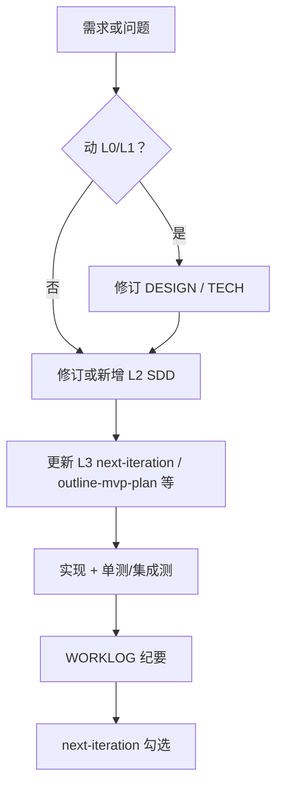

# 规约体系与 SDD 开发框架

本文定义本仓库 **文档如何分层**、**何为可当作「规约」依据**、以及 **从想法到合并代码** 的推荐流程（类 **Spec-Driven Development + 软件设计说明 SDD**）。实现细节仍以各专题文档与代码为准。

---

## 1. 术语

| 术语 | 在本仓库中的含义 |
|------|------------------|
| **Spec（规约）** | 对行为、数据或流程的**约定**：实现与测试应与之对齐；变更规约应有意识更新依赖文档与代码。 |
| **SDD** | **Software Design Document**：在规约之下，对某一子域的**结构设计、接口与落地步骤**的说明；可含方案比选与「待拍板」段。 |
| **MVP / 执行方案** | 将 SDD 中大块能力**切成可交付阶段**，带验收清单（如 `planning/outline-mvp-plan.md`）。 |

---

## 2. 文档分层（L0–L4）

自上而下：**越上层越稳定、越偏「为什么与不许做什么」；越下层越易变、越偏「怎么做与当前排期」**。

| 层级 | 名称 | 典型内容 | 本仓库示例 |
|------|------|----------|------------|
| **L0** | 产品愿景 / 域模型 | 世界观、多 Agent 理念、非目标 | [DESIGN.md](../../DESIGN.md)（仓库根目录） |
| **L1** | 技术规约 | 组件边界、配置与存储键约定、主流程与测试门禁 | [TECH_IMPLEMENTATION.md](../../TECH_IMPLEMENTATION.md)（根目录） |
| **L2** | 领域 / 专题 SDD | 单一横切面的数据模型、交互状态机、与代码挂载点 | [docs/design/](../design/) 下各专题 |
| **L3** | 执行计划与 MVP | 分阶段验收、与 L2 对齐的落地顺序 | [planning/next-iteration.md](../planning/next-iteration.md)、[planning/outline-mvp-plan.md](../planning/outline-mvp-plan.md) 等 |
| **L4** | 操作与协作手册 | 环境、Git、Cursor/DevAgent、用法 | [guides/](../guides/) 下各手册 |

**约定**：**L0/L1 冲突时以 L1 技术可实现性与数据模型为准**，并应**回写**修订 L0 表述；L2 不得与 L1 硬冲突，若需突破 L1 须先改 TECH 规约。

### 2.1 迭代开发：文档先行（Spec / SDD）

为满足**可评审、可回归、可切片交付**，团队在改**作者在环、设定阶段、意图分类、检索注入、回合审阅**相关实现时，应默认遵守：

1. **先对齐规约**：行为或验收有变时，先更新 **S2** [specs/author-in-loop-spec.md](../specs/author-in-loop-spec.md)（含 **§1.1**）、根目录 **DESIGN** / **TECH** 相关节，或 **D6** [author-agent-harness.md](../design/author-agent-harness.md)（含 **§6.1 R\***）；大块 Harness 重构以 **R0→R8** 为序，见 D6 §6.1。  
2. **方案可见再编码**：在 PR、协作会话或 `WORKLOG` 中列出「触及的规约段落、模块落点、单测计划」；**确认后再改 `src/`**（纯重构/纯恢复规约的 bugfix 可简化，但仍建议在 WORKLOG 一行指向文档）。  
3. **工具侧**：仓库 **`.cursor/rules/doc-first-spec-sdd.mdc`**（`alwaysApply: true`）要求 Cursor 助手默认遵守上述顺序。  
4. **收尾**：更新 [planning/next-iteration.md](../planning/next-iteration.md) 勾选；规约级变更写入 [WORKLOG.md](../../WORKLOG.md)。

**MAIN_WRITING 审阅（R7）**：行为 SHOULD 见 **S2 §3.4**（含 **§3.4** 文末**实现进度**说明）；分步与代码挂载点以 **D6 [author-agent-harness.md](../design/author-agent-harness.md) §6.3** 为 SSOT；`next-iteration` 中 **R7 子步表** 与 §6.3 同步。**编码现状**：**R7b–R8** 已落地（含 **R7e** 阶段二可观测、**R8** 日志与单测链；**`apply_main_writing_review_ingress`** 在 `review_turn_result` 内懒加载）；细节见 next-iteration **R7 子步**、D6 §6.3。

**产品级多智能体（PM / Tools）**：概念与路线以 **D7 [novel-assistant-pm-agent-model.md](../design/novel-assistant-pm-agent-model.md)** 为 SSOT；**P0–P4** 排期见 [planning/next-iteration.md](../planning/next-iteration.md) **「产品级路线」**。

**组装后上下文压缩（检索 → 组装之后）**：目标态与分阶段落地以 **D8 [context-compression-adaptive-layered.md](../design/context-compression-adaptive-layered.md)** 为 SSOT；与 **U-1「检索完整方案」** 治理条互链增量修订；当前实现仍以 `retrieve_for_intent` **硬预算截断**为主，见 D8 §4。

**小说作者在环工作台（Web）**：**D9**；`author_workbench.enabled=true` 时 **Web 唯一交互**、CLI **仅日志**；W0–W6 见 [novel-reader-ui.md](../design/novel-reader-ui.md)。

---

## 3. 规约与 SDD 登记表（权威索引）

下列文件为 **AI 与开发者实现时的主要依据**；状态为「规约」的变更应更谨慎，并同步测试与 WORKLOG。

| ID | 路径 | 类型 | 层级 | 说明 |
|----|------|------|------|------|
| S0 | [DESIGN.md](../../DESIGN.md) | 产品 Spec | L0 | 多 Agent、世界/范围、作者在环理念 |
| S1 | [TECH_IMPLEMENTATION.md](../../TECH_IMPLEMENTATION.md) | 技术 Spec | L1 | 编排、Storage、配置合并、回合与写回 |
| S2 | [specs/author-in-loop-spec.md](../specs/author-in-loop-spec.md) | 行为 Spec（切片） | L1 | 作者在环 MUST/SHOULD/不承诺；与 D1/D6 配套 |
| D1 | [design/author-interaction.md](../design/author-interaction.md) | SDD | L2 | 作者在环状态机、M1–M6（实现细节；行为边界见 **S2**） |
| D2 | [design/memory-storage-and-retrieval.md](../design/memory-storage-and-retrieval.md) | SDD | L2 | 记忆目录、双写、渐进检索 |
| D3 | [design/outline-and-beats.md](../design/outline-and-beats.md) | SDD | L2 | 大纲/节拍/主角轴/多线叙事原则 |
| D4 | [design/character-growth-state-machine.md](../design/character-growth-state-machine.md) | SDD | L2 | 成长状态机与 GrowthGuard（规划） |
| D5 | [design/llm-and-agents.md](../design/llm-and-agents.md) | SDD | L2 | LLM Provider、Agent 接入约定 |
| D6 | [design/author-agent-harness.md](../design/author-agent-harness.md) | SDD | L2 | 作者在环统一入口、Agent Harness 分层与迁移切片 |
| D7 | [design/novel-assistant-pm-agent-model.md](../design/novel-assistant-pm-agent-model.md) | 概念 SDD | L2 | PM/小说项目/记忆体/全局 Tools/DevAgent；与 D6 互补；**非**代码逐条映射 |
| D8 | [design/context-compression-adaptive-layered.md](../design/context-compression-adaptive-layered.md) | SDD | L2 | 组装后上下文：**自适应分层任务锚定压缩**、Compression Contract、与 `retrieve_for_intent` 截断的关系 |
| D9 | [design/novel-reader-ui.md](../design/novel-reader-ui.md) | SDD | L2 | **作者在环工作台**（Web）：阅览 + 与 CLI 等价的设定讨论/章节回合交互；Session API + `WebInputAdapter`；W0–W6 |
| D10 | [design/parallel-thread-bridging.md](../design/parallel-thread-bridging.md) | SDD | L2 | **G1 屏外线/并列主线**（off-screen 演进 + 桥接摘要，大纲 Phase 3）：屏外记忆类型、按需触发、桥接注入、成长复用 |
| D11 | [design/evolution-pacing-coupling.md](../design/evolution-pacing-coupling.md) | SDD | L2 | **G2 演进层 ↔ 叙事策略层耦闸**：成长站姿进 PacingContract/Critic（前馈）、节拍 `tags` 实影响成长（反馈），默认关 |
| D12 | [design/user-adjustable-and-runtime-lens.md](../design/user-adjustable-and-runtime-lens.md) | SDD | L2 | **G3 用户可调收敛 + 运行时主角切换**：统一「能力开关」`runtime.features` 外观面 + CLI/D9 `/system` 出口 + 运行时镜头 `ProtagonistContext`，默认全关 |
| E1 | [planning/outline-mvp-plan.md](../planning/outline-mvp-plan.md) | MVP 执行说明 | L3 | 大纲 MVP-0/1/2 范围与验收 |
| E2 | [planning/next-iteration.md](../planning/next-iteration.md) | 迭代清单 | L3 | 进行中 / 下一步 / 已完成 |
| O1 | [guides/usage.md](../guides/usage.md) | 手册 | L4 | 使用方式 |
| O2 | [guides/development.md](../guides/development.md) | 手册 | L4 | Linux 环境、命令；**§七** 代码修改前 Spec/SDD 先行 |
| O3 | [guides/cursor-and-devagent-workflow.md](../guides/cursor-and-devagent-workflow.md) | 手册 | L4 | Cursor 与 DevAgent 协同 |
| O4 | [guides/agent-and-llm-setup.md](../guides/agent-and-llm-setup.md) | 手册 | L4 | 可选框架与 API 说明 |
| O5 | [guides/git-commit.md](../guides/git-commit.md) | 手册 | L4 | 提交约定 |

**根目录** [WORKLOG.md](../../WORKLOG.md) 为**过程纪要**（非规约）：记录已发生决策与日期，**不**替代 L1/L2 的条文。

---

## 4. SDD 式开发流程（推荐）

1. **定边界**：新能力先落在 **L2 专题 SDD**（`docs/design/`）或先写 **`planning/` 下 MVP 文档**，写明与 Orchestrator / config / `data_root` 的挂载点。  
2. **对齐 L1**：若涉及存储键、配置合并顺序、新 Agent 类型，必须在 **TECH_IMPLEMENTATION** 中可找到或**增补**对应条目。  
3. **拆交付**：大功能用 **L3 MVP 文档** 拆阶段与验收，避免一次 PR 混杂多规约变更。  
4. **门禁**：合并前 **pytest** 通过；规约级变更建议在 WORKLOG 记一行「动了哪份 Spec/SDD」。  
5. **闭环**：完成后更新 **`docs/planning/next-iteration.md`**；DevAgent 产出的 `cursor_tasks` 应对齐 L3 条目编号或文档名。

---

## 5. 与 AI（Cursor）协作时的引用顺序

向助手描述任务时，建议**按层级附带链接**，减少幻觉与越权改规约：

1. 若改交互主流程：先 **design/author-agent-harness.md**（统一入口目标态）→ **design/author-interaction.md** → **TECH_IMPLEMENTATION** 相关章。  
2. 若改存储与记忆：**design/memory-storage-and-retrieval.md** → **TECH_IMPLEMENTATION** §存储。  
3. 若改大纲与正文管线：**design/outline-and-beats.md** + **planning/outline-mvp-plan.md** → 代码 `outline_store` / `turn_planning`。  
4. 若改开书设定阶段门闩、作品目录引导或设定审阅展示：**design/author-interaction.md** §11 / §11.1 → **TECH_IMPLEMENTATION.md** §6 段首 → 代码 `novel_bootstrap` / `design_phase`。  
5. 若改 **检索组装之后的上下文压缩**（契约、门限、分块压缩）：**design/context-compression-adaptive-layered.md（D8）** → **author-agent-harness.md**（PromptAssembler 挂载点）→ `retrieve_for_intent` / 组装出口。
6. 若改 **小说阅读 Web UI / Read API**：**design/novel-reader-ui.md（D9）** → **memory-storage-and-retrieval.md（D2）** / **outline-and-beats.md（D3）** → `outline_store` / `file_sync` / `relationship_graph`。

---

## 6. 反模式（尽量避免）

- **无 SDD 直接大改核心流程**：事后补文档成本高，易与 L1 冲突。  
- **只更新 next-iteration 不更新专题文档**：排期与真实设计脱节。  
- **在 WORKLOG 写死行为条文**：WORKLOG 应指向正式 Spec/SDD 路径，避免双源真相。  
- **L2 文档与代码长期不同步**：合并时至少更新文档「修订记录」或验收段落。

---

## 7. 修订记录

- **2026-03-29**：初版；建立 L0–L4 分层、登记表与 SDD 流程；与 `docs/README.md` 互链。  
- **2026-03-29（续）**：登记表路径对齐 `design/`、`planning/`、`guides/` 子目录。  
- **2026-04-04**：§5 增补「开书设定阶段 / 作品门闩」协作引用链（author-interaction §11.1、TECH §6）。  
- **2026-04-04（续）**：登记表新增 D6 `author-agent-harness.md`；§5 交互主流程引用链加入 Harness 文档。  
- **2026-04-05**：登记表新增 **S2** `specs/author-in-loop-spec.md`（作者在环 L1 切片）；D1 说明与 S2 分工。  
- **2026-04-06**：新增 **§2.1 迭代开发：文档先行**；互链 S2 §1.1、D6 §6.1、`.cursor/rules/doc-first-spec-sdd.mdc`、WORKLOG。  
- **2026-04-09**：§2.1 增补 **R7** 指针（S2 §3.4、D6 §6.3、next-iteration R7 子表）。  
- **2026-04-10**：登记表新增 **D7** `novel-assistant-pm-agent-model.md`；§2.1 增补 **D7 / P0–P4** 与 `next-iteration` 互链。  
- **2026-03-29**：§2.1 **MAIN_WRITING R7** 指针增补：S2 §3.4 实现进度；R7b/R7c 与 R7d 待办；登记表新增 **D8** `context-compression-adaptive-layered.md`；§2.1、§5 增补 **上下文压缩** 协作链。
- **2026-06-14**：登记表新增 **D9** `novel-reader-ui.md`；§2.1、§5 增补 **小说阅读 Web UI** 协作链。
